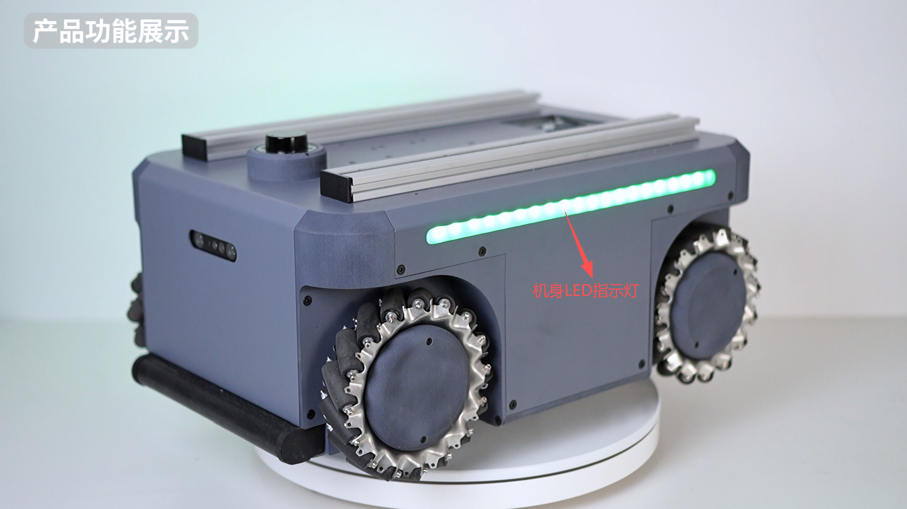
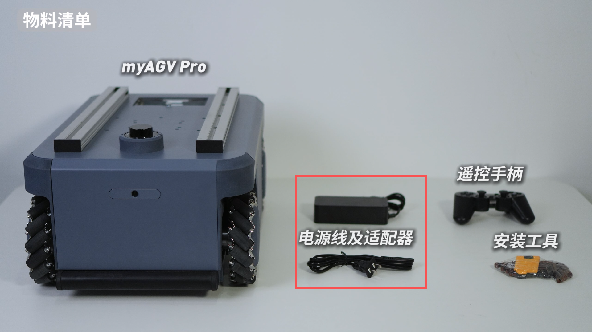
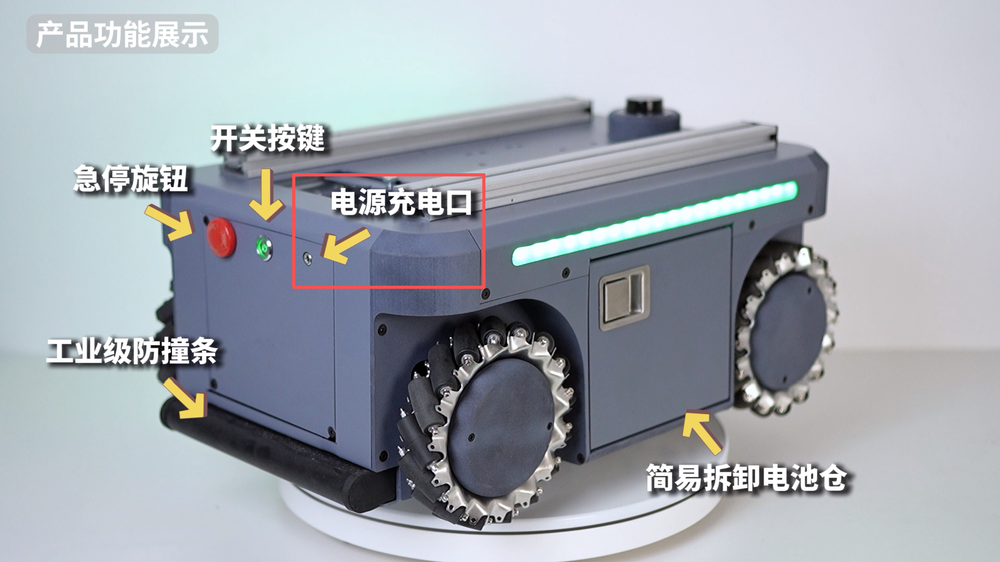
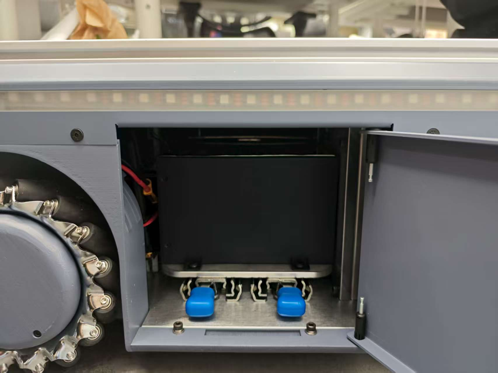
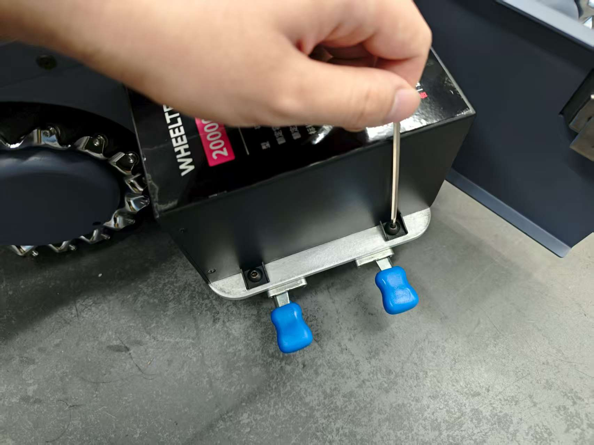
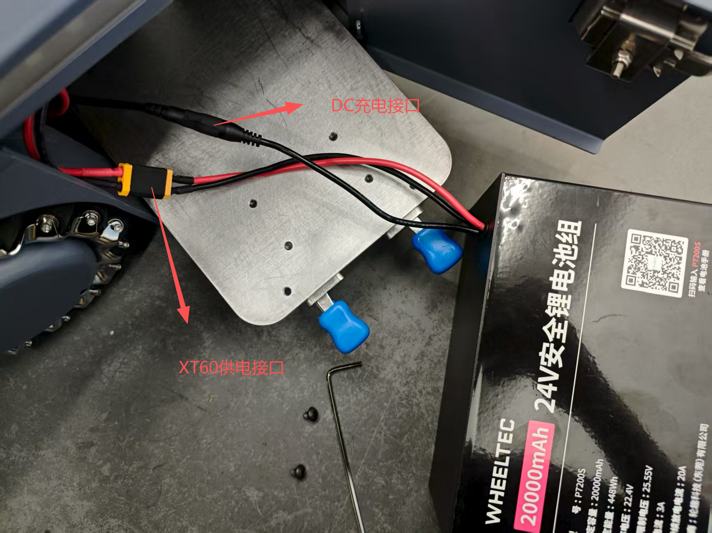
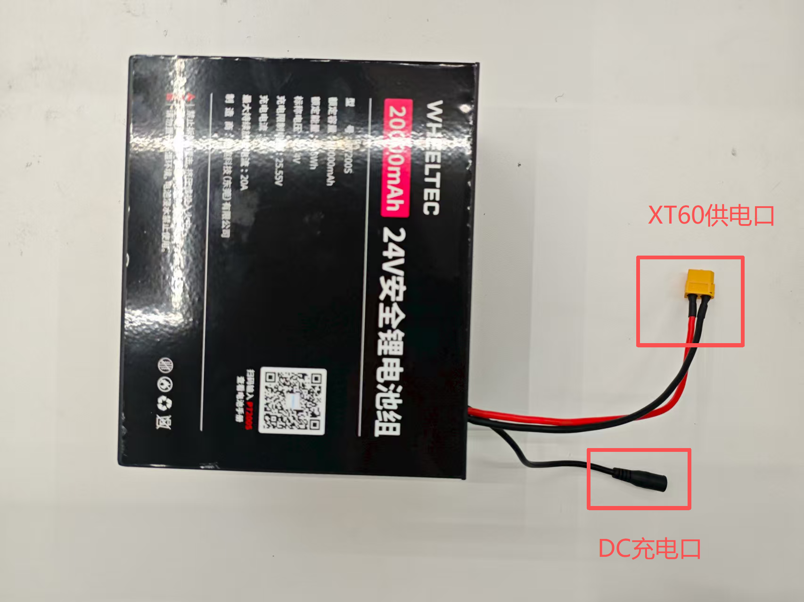
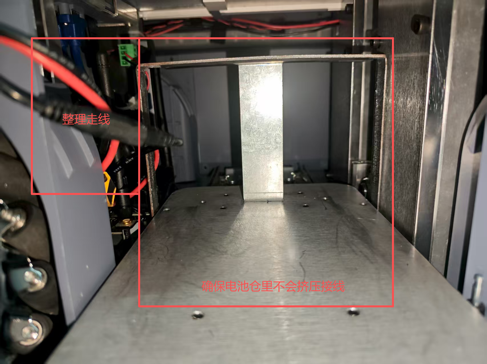
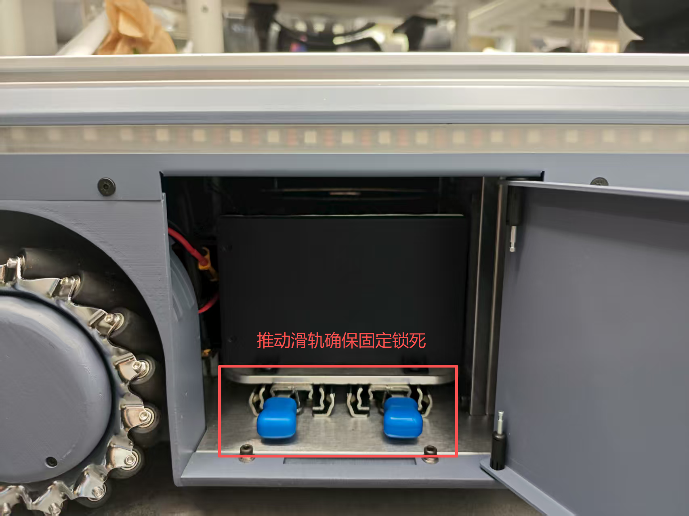

## 3.3 充电说明

### myAGV灯态电量指示说明
AGV机身LED指示灯通过颜色和闪烁状态直接反映当前剩余电量，用户需根据灯态及时采取对应操作：  
- **红灯闪烁**  ：剩余电量   **≤10%**  ，需立即充电（低电量警告）；
- **黄灯闪烁**  ：剩余电量   **>10%** 且 **≤20%**  ，建议尽快充电（电量不足）；
- **绿灯常亮**  ：剩余电量   **>20%**  ，电量充足，可正常运行。

### myAGV充电建议
> 当AGV显示**黄灯闪烁**时，建议在30分钟内完成充电以避免深度放电；若显示**红灯闪烁**，需立即停止任务并充电，长期低电量运行可能缩短电池寿命。

### 充电适配器规格与使用
- **接口类型**  ：DC4017圆形接口（直径4.0mm，长度17mm，中心正极）。
- **兼容性** ：必须使用原装标配适配器，禁止使用其他型号或非认证适配器（可能导致过压/欠压损坏电池）。
- **连接方式**  ：将适配器插头对准AGV充电接口垂直插入，适配器另一端接入220V交流电源插座（需确保插座接地良好）。
- **启动充电**  ：确保AGV处于关机状态或已进入待机模式，连接适配器后，AGV充电指示灯红亮起，开始充电。
- **中断充电**  ：充电完成后需先断开适配器与电源插座的连接，再拔下AGV端插头，禁止在充电过程中直接拔插头（可能导致电弧损伤接口）。
- **环境要求**  ：充电环境温度需在**0℃~40℃**之间，避免高温、潮湿或通风不良环境，禁止在易燃物附近或密闭空间内充电。

### 充电完成与维护
- **充电时长**  ：**6-7小时充满**，充满电后电源适配器指示灯会常亮绿灯。
- **充满判定**  ：绿灯常亮后建议继续充电**10-15分钟**以平衡电池电量（锂电保护机制可能提前终止充电）。
- **长期存放充电建议**  ：若设备需停放超过7天，需保持电池电量在**50%-70%**区间，并每1个月完成一次完整充放电循环。
- **电池保养**  ：避免完全放电（电量≤5%），否则可能缩短电池寿命；定期通过管理软件检查电池健康状态（如内阻、容量衰减）。

---
> 提示：
> - 充电适配器为易损件，若出现插头松动、过热或灯态异常，需立即停用并更换；
> - 充电过程中需人员值守（尤其是首次使用或更换适配器后），若发现异味、冒烟等异常需立即断电并联系售后。

### 从电池仓拆卸更换电池

1.打开侧板的面板锁

2.从滑轨拉出电池仓

3.使用内六角扳手拧开螺丝

4.myAGV Pro引出两根接线，分别是XT60供电接口和DC充电接口。

5.拆卸更换新的电池，也同样接线到XT60供电接口和DC充电接口。

6.两根接线进行整理走线，放入左侧空间中，中间确保预留出空间，让电池能够放入电池仓内。

7.使用内六角扳手拧紧螺丝

8.从滑轨推进电池仓

9.关闭侧板的面板锁

---

[← 上一页](3.2-TransportandStorage.md) | [下一页 →](3.4-FAQs.md)