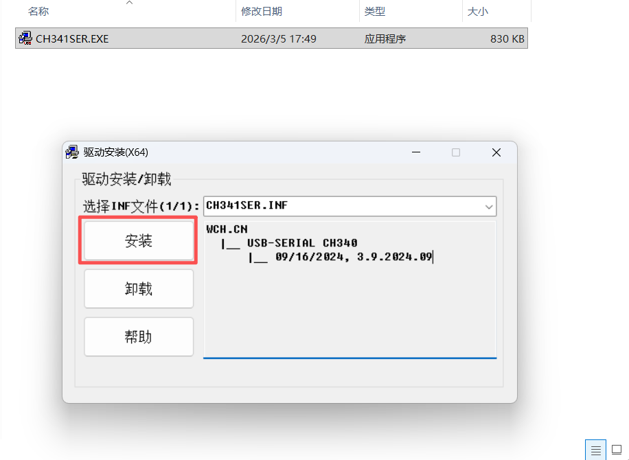
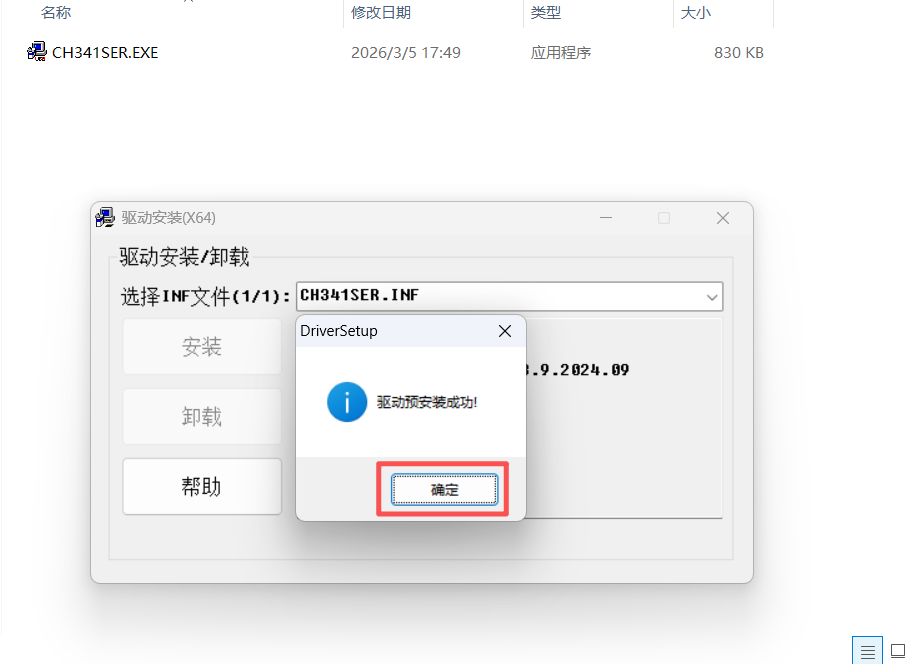
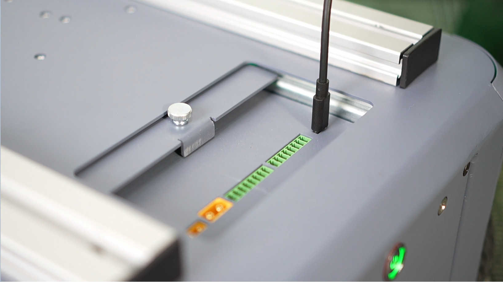
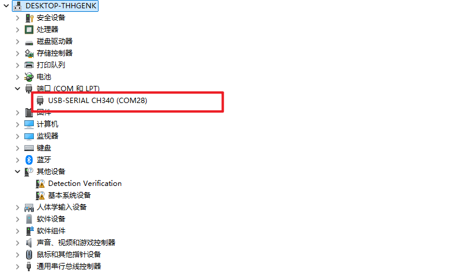

## 4.1 基础版
### 4.1.1 物料清单：
|      名称       | 数量 |
|:-------------:|:--:|
| myAGV Pro整机	  | 1  |    
|     无线手柄	     | 1  |    
|    USB线缆	     | 1  |    
|     扳手工具	     | 1  |    
|     产品画册	     | 1  |    


### 4.1.2 windows快速体验

需要在您的电脑上安装`CH340`串口驱动，安装方法请参考如下：

1.下载[CH341SER.EXE](https://download.elephantrobotics.com/software/drivers/CH341SER.EXE)

2.鼠标双击.EXE应用程序并点击安装按钮。



3.安装成功后点击确认。



4.将`myAGV Pro`放置在水平平面上，将`myAGV Pro`的急停拨开后摁下电源启动键，启动`myAGV Pro`

5.使用`TYPE-C`线将`myAGV Pro`与Windows连接起来



6.打开PC的设备管理器，找到`myAGV Pro`的`USB`设备



7.需要在您的电脑上安装`python`环境，并安装`pymycobot`库, 安装方法请参考[python安装及pymycobot](../6-SDKDevelopment/6.1-ApplicationBasePython/README.md), 在配置好环境之后您可以执行一下步骤:

在Windows任意目录下新建`example.py`文件，并输入以下代码

```python
    import time
    from pymycobot import MyAGVPro
    
    
    def main():
        agv = MyAGVPro("COM28", debug=True)
        if agv.is_power_on() != 1:
            agv.power_on()
    
        agv.move_forward(0.1)
        time.sleep(2)
        agv.stop()
    
        agv.move_backward(0.1)
        time.sleep(2)
        agv.stop()
    
        agv.turn_left(0.1)
        time.sleep(2)
        agv.stop()
        time.sleep(1)
    
        agv.turn_right(0.2)
        time.sleep(2)
        agv.stop()
    
    
    if __name__ == '__main__':
        main()
```

8.在命令行中执行`python example.py`，即可看到`myAGV Pro`开始移动

### 4.1.3 Linux快速体验

需要在您的Linux电脑上安装CH340串口驱动，安装方法请参考如下：

1.下载[CH341SER_LINUX.ZIP](https://download.elephantrobotics.com/software/drivers/CH341SER_LINUX.ZIP)到根目录下。或者执行下面终端指令:

```bash
wget https://download.elephantrobotics.com/software/drivers/CH341SER_LINUX.ZIP
```

2.执行下面终端指令安装驱动：

```bash
cd CH341SER_LINUX/driver/

make
sudo make load
sudo make install
```

3.重新插拔`TYPE-C`线，可以在终端输入下面指令搜索设备名，

```
ls -l /dev/ttyCH341USB*
```

如果串口驱动正常安装，则搜索多出/dev/ttyCH341USB0设备

```
/dev/ttyCH341USB0
```

4.需要在您的Linux设备上安装`python`环境，并安装`pymycobot`库

```
pip install pymycobot
```

5.连接设备

将`myAGV Pro`放置在水平平面上，将`myAGV Pro`的急停拨开后摁下电源启动键，启动`myAGV Pro`

使用`TYPE-C`线将`myAGV Pro`与Linux设备连接起来


6.在根目录下新建`example.py`文件，并输入以下代码

```python
    import time
    from pymycobot import MyAGVPro
    
    
    def main():
        agv = MyAGVPro("/dev/ttyCH341USB0", debug=True)
        if agv.is_power_on() != 1:
            agv.power_on()
    
        agv.move_forward(0.1)
        time.sleep(2)
        agv.stop()
    
        agv.move_backward(0.1)
        time.sleep(2)
        agv.stop()
    
        agv.turn_left(0.1)
        time.sleep(2)
        agv.stop()
        time.sleep(1)
    
        agv.turn_right(0.2)
        time.sleep(2)
        agv.stop()
    
    
    if __name__ == '__main__':
        main()
```

7.在命令行中执行`python example.py`，即可看到`myAGV Pro`开始移动

---

[← 首次安装使用页](README.md) | [下一页 →](4.2-NavigationVisualEdition/4.2-NavigationVisualEdition.md)
