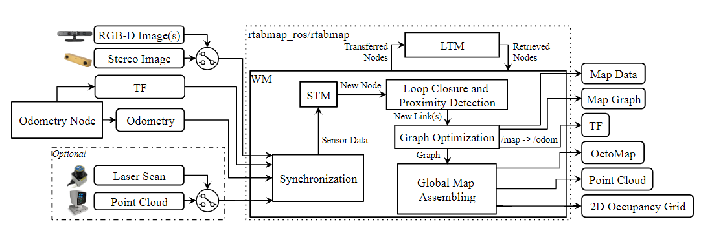
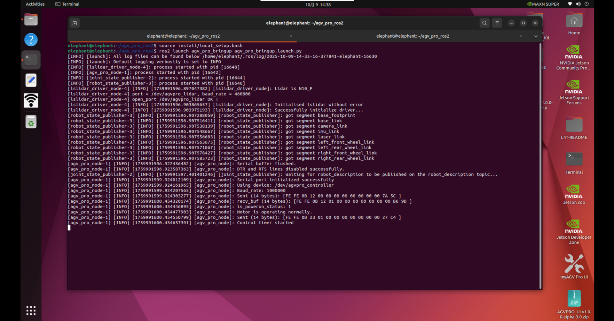
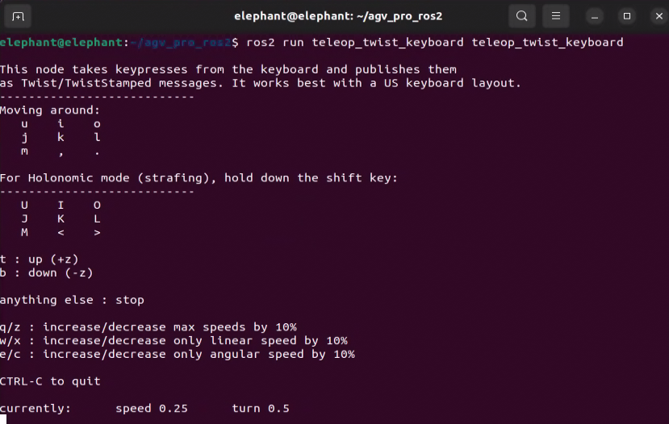
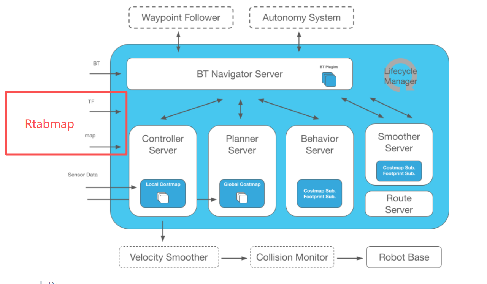
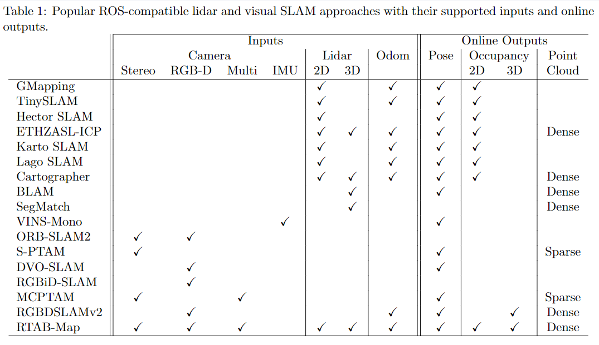
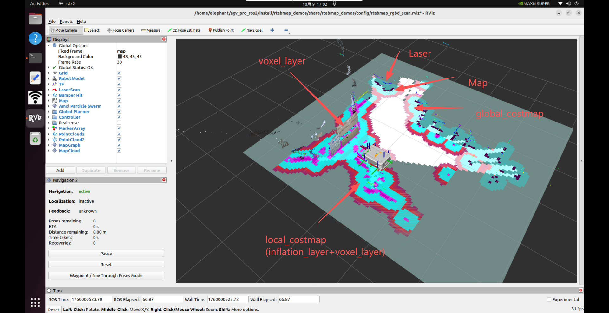
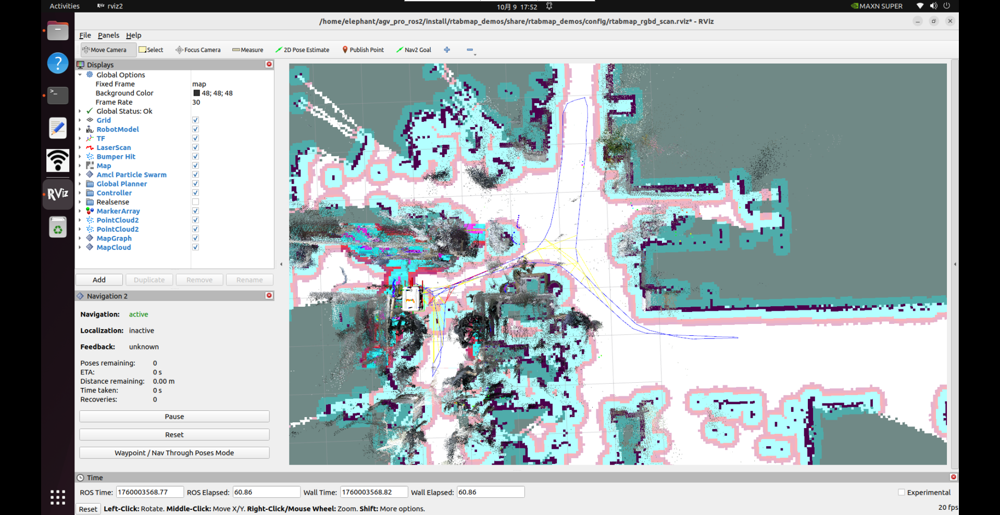

# Rtabmap概述

[RTAB-Map](https://introlab.github.io/rtabmap/)（基于实时外观的映射）是一种基于 RGB-D、双目和激光雷达图的 SLAM 方法，基于增量外观的回环检测器。回环检测器使用词袋方法来确定新图像来自先前位置或新位置的可能性。当闭环假设被接受时，一个新的约束被添加到地图的图表中，然后图表优化器最小化地图中的错误。内存管理方法用于限制用于闭环检测和图形优化的位置数量，以便始终遵守大规模环境的实时约束。RTAB-Map 可单独与手持式 Kinect、双目相机或 3D 激光雷达一起使用以进行 6DoF 测绘，或者在配备激光测距仪的机器人上使用以进行 3DoF 测绘。



## Rtabmap建图

1.按下键盘（ctrl+alt+t）打开第一个终端，运行下面的指令，启动里程计和激光雷达节点。

```
ros2 launch agv_pro_bringup agv_pro_bringup.launch.py
```



2.按下键盘（ctrl+alt+t）打开第二个终端，运行下面的指令，启动深度相机节点。

```
ros2 launch orbbec_camera gemini2.launch.py
```


3.按下键盘（ctrl+alt+t）打开第三个终端，运行下面的指令，启动Rtabmap SLAM建图。

```
ros2 launch rtabmap_demos robot_mapping_demo.launch.py rviz:=true rtabmap_viz:=false
```

- `rviz`:启动 rviz2可视化数据界面。
- `rtabmap_viz`:启动 RTAB-Map UI 可视化数据界面（可选项）。

4.启动rviz2可视化界面后，会显示激光雷达和深度相机生成的栅格地图和点云建图效果。

此时按下键盘（ctrl+alt+t）打开第四个终端，运行键盘控制节点，控制myagv pro移动完成场景的建图。

```
ros2 run teletop_twist_keyboard teletop_twist_keyboard
```



注：为保证建图质量，在建图过程中使用键盘控制小车时应尽量使小车保持匀速稳定行驶，部分情况下急变速、急转弯以及长时间原地自转等行为有可能导致建图精度下降或建图失效，推荐使用键盘节点默认的控制参数，即speed 0.25, turn 0.5。


如上图建好需要的场景地图后，在`robot_mapping_demo.launch.py`终端下，按下键盘的`ctrl+c`关闭程序。程序关闭时会将构建的地图数据保存在`~/.ros/rtabmap.db`路径下。`~/.ros`为隐藏文件夹，可以按下键盘`ctrl+h`显示隐藏文件夹。

## Rtabmap+NAV2 同时定位建图和导航

可以使用Rtabmap进行slam地图建图和导航。由rtabmap替换nav2中的amcl功能，完成机器人在导航框架中的定位与建图。



rtabmap支持多种传感器数据进行建图。



myagv pro导航版的车身带有[rgbd相机](../../2-ProductFeature/2.2-VisualNavigationEdition.md#3d深度相机-gemini-2技术规格选配)和[2d激光雷达](../../2-ProductFeature/2.2-VisualNavigationEdition.md#n10-plus-激光雷达技术规格选配)。下面介绍rtabmap(rgbd+laser scan+odom)结合nav2的使用方法。

1.按下键盘（ctrl+alt+t）打开第一个终端，运行下面的指令，启动里程计和激光雷达节点。

```
ros2 launch agv_pro_bringup agv_pro_bringup.launch.py
```


2.按下键盘（ctrl+alt+t）打开第二个终端，运行下面的指令，启动深度相机节点。

```
ros2 launch orbbec_camera gemini2.launch.py
```


3.按下键盘（ctrl+alt+t）打开第三个终端，运行下面的指令，启动Rtabmap SLAM建图+NAV2。

```
ros2 launch rtabmap_demos agvpro_rgbd_scan.launch.py
```

4.启动rviz2可视化界面后，会显示激光雷达和深度相机生成的栅格地图和点云建图效果，并且左下角已经加载了nav2的插件。同时可以在rviz看到nav2代价地图中的障碍物地图层+体素层+膨胀层可视化数据。其中体素层由rtabmap的`/camera/obstacles`和`/camera/ground`点云数据和`/scan`2d激光雷达数据进行维护。相比于单个2d激光雷达导航，能实现更优的路径规划导航。



单击 RVIZ 中的“Nav2 Goal”按钮设置目标，鼠标往空闲栅格地图拖动箭头发送导航目标点，myagv pro将进行路径规划后导航到对应的目标。进行同时定位建图和导航。

导航更多详情资料可以参考[6.2.3-Navigation2章节](6.2.3-Navigation2.md)。

最终构建我们需要的场景地图，如下图建好需要的场景地图后，在`agvpro_rgbd_scan.launch.py`终端下，按下键盘的`ctrl+c`关闭程序。程序关闭时会将构建的地图数据保存在`~/.ros/rtabmap.db`路径下。`~/.ros`为隐藏文件夹，可以按下键盘`ctrl+h`显示隐藏文件夹。



5.除此之外，还可以单独基于rgbd相机，进行同时定位建图和导航。

```
# Example:
#   Bringup agvpro:
#     $ ros2 launch agv_pro_bringup agv_pro_bringup.launch.py
#
#   Bringup orbbec gemini2 camera:
#     $ ros2 launch orbbec_camera gemini2.launch.py
#
#   SLAM:
#     $ ros2 launch rtabmap_demos agvpro_rgbd.launch.py
```

6.除此之外，还可以单独基于2d激光雷达，进行同时定位建图和导航。

```
# Example:
#   Bringup agvpro:
#     $ ros2 launch agv_pro_bringup agv_pro_bringup.launch.py
#
#   SLAM:
#     $ ros2 launch rtabmap_demos agvpro_scan.launch.py
```

## Rtabmap+NAV2 定位和导航

构建完一个场景区域地图后，可以将rtabmap置于本地化模式以避免增加已绘制区域的地图大小。

相当于直接加载`~/.ros/rtabmap.db`先验地图，再进行重定位导航。使用方法如下，在启动launch.py文件时增加`localization:=true`参数

```
ros2 launch rtabmap_demos agvpro_rgbd_scan.launch.py localization:=true
```

移动机器人直到它可以在之前的地图中重定位，然后当发现闭环时，2D 地图将再次重新出现，再进行后续开发的导航任务。


---

[← 上一页](6.2.8-Autocharge.md)