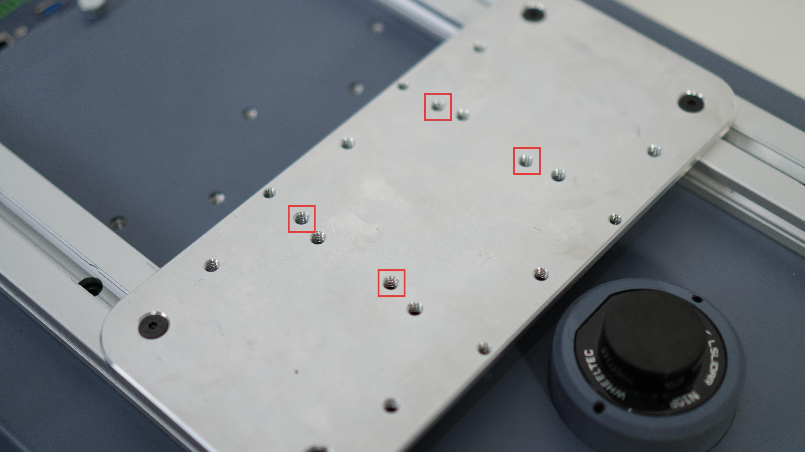
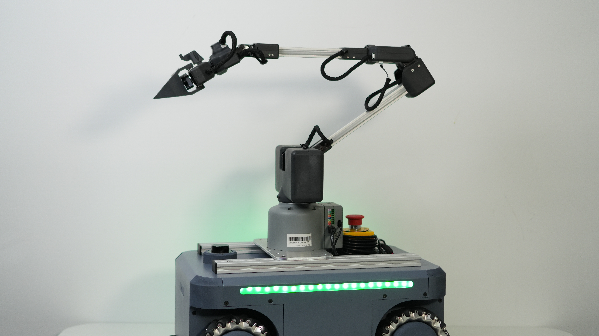

## 家居收纳训练


## 1. 硬件部署

### 1.1 硬件清单

| 名称                | 数量 | 备注 |
|-------------------|----|----|
| 外接固定板             | 1  |    |
| M5滑块螺母            | 4  |    |
| M5*10螺丝           | 4  |    |
| MyArm M750        | 1  |    |
| myAGV Pro 导航-视觉版	 | 1  |    |
| 无线手柄	             | 1  |    |
| USB线缆	            | 1  |    |
| 扳手工具	             | 1  |    |
| XT60转接线	          | 1  |    |

### 1.2 硬件连接

1. 使用M5*10螺丝将M5滑块螺母固定在外接固定板上
   
2. 将外接固定板连接到myAGVPro上的2040型材
   
3. 将myArm M750 底座与外接固定板上的螺丝孔位对齐
   
4. 将myArm M750 底座固定在外接固定板上
   
5. 连接急停
   
6. 使用XT60转接线连接至myArm M750
   
7. 将另一端与myAGV Pro上XT60供电口连接
   
8. 启动 myAGV Pro, 需要先将急停松开， 然后按下电源开关
   
9. 启动myArmM750, 同样需要先将急停松开， 然后按下电源开关, 等待MyArmM750启动完成
10. 使用`Type-C`线连接myArm M750与myAGV Pro
    
    
11. 至此，MyArm M750与myAGV Pro硬件连接完成, 成品如下所示:
    

## 2. 软件部署

### 2.1 MyArm M750固件烧录

通过访问M750[烧录和更新固件](https://docs.elephantrobotics.com/docs/myarm-master_750-cn/4-FunctionsAndApplications/5-BasicFunctions/5.2-SoftwareUsageInstructions/5.2.3-flash_firmwares.html)
章节进行烧录固件

### 2.2 myAGVPro固件烧录

通过访问myAGVPro[如何刻录固件](../5-BasicApplication/5.3-FirmwareUse/5.3.2-HowToBurnFirmware.md)章节进行烧录固件

## 3. 源码下载

将家居收纳训练-MyArm M750手柄控制源码下载到本地

### 3.1 下载源码

1. 使用git工具将源码下载到本地
   ```shell
   git clone https://github.com/elephantrobotics/pymycobot.git
   ````
2. 使用浏览器访问网址下载源码压缩包
   

- 访问[https://github.com/elephantrobotics/pymycobot.git](https://github.com/elephantrobotics/pymycobot.git)
- 点击`Code`按钮
- 点击`Download ZIP`按钮
- 下载完成后解压到本地

### 3.2 进入`myAGVPro_Composite_Kit`目录

使用`cd`指令进入`pymycobot/demo/myAGVPro_Composite_Kit`目录下

```shell
cd pymycobot/demo/myAGVPro_Composite_Kit
```

### 3.3 下载依赖

使用`pip`指令下载依赖

```shell
pip install -r requirements.txt
```

### 3.4 修改配置

1. 打开`main.py`文件, 将`COMPOSITE_KIT_TYPE`的值修改成`MyArmM750`

    ```python
    ...
    # ##############################################################################################
    # Composite kit configuration
    # ##############################################################################################
    COMPOSITE_KIT_TYPE = "MyArmM750"  # MyCobotPro630, MyCobot320, MyArmM750, Undefined
    DEBUG = False
    ...
    ```

2. 配置`MyArmM750`串口, 通过`ls /dev/tty*`命令查看, 正常情况下默认为`/dev/ttyACM2`

    ```python
    ...
    # ##############################################################################################
    # MyCobot M750 and MyCobot 320 Configuration
    # ##############################################################################################
    COMPOSITE_KIT_COMPORT = "/dev/ttyACM2"
    ...
    ```

### 3.5 运行源码

使用`python`指令运行源码

```shell
python main.py
```

## 4. 快速体验

myAGV pro + MyArm M750手柄控制功能定义如下:


> **注意：** 在程序启动前需要先把手柄的接收器接入myAGV Pro的`USB`口, 程序启动后, 当手柄的接收器断开连接时, 程序会自动退出

