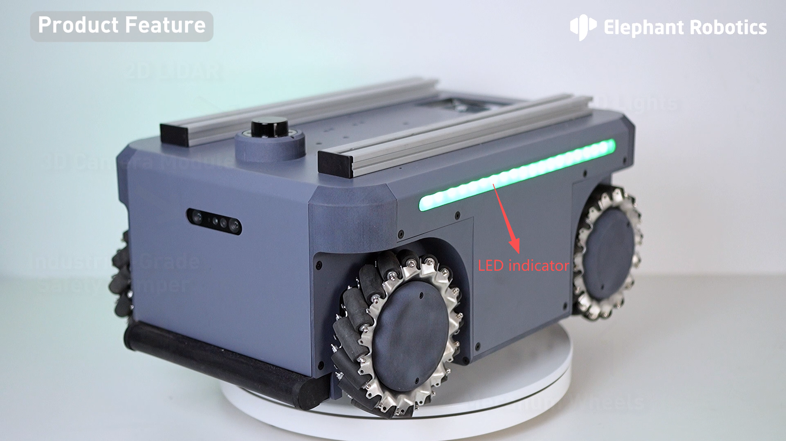
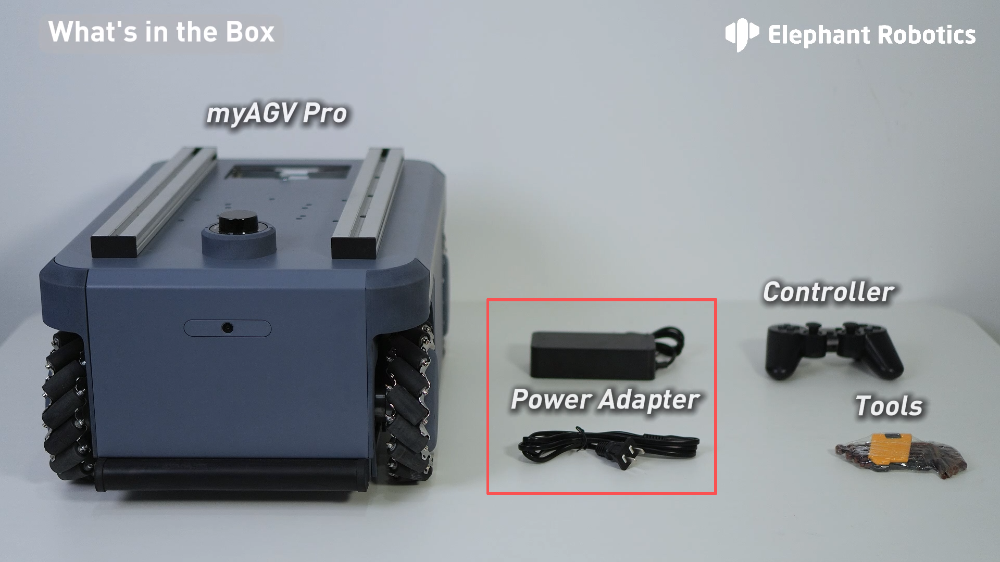
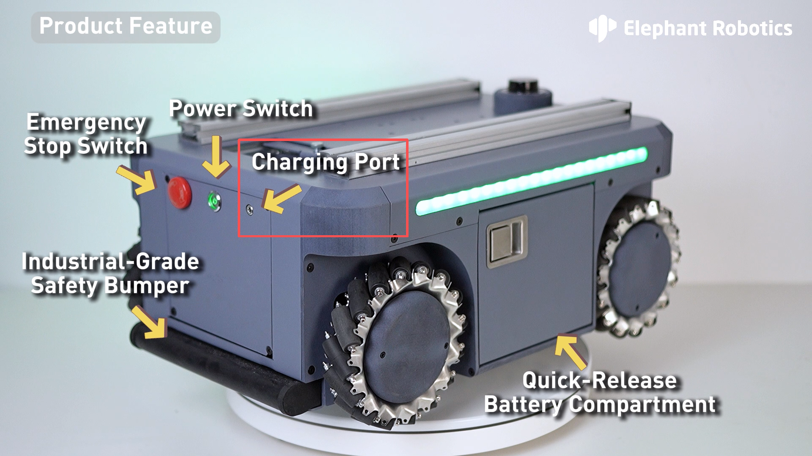
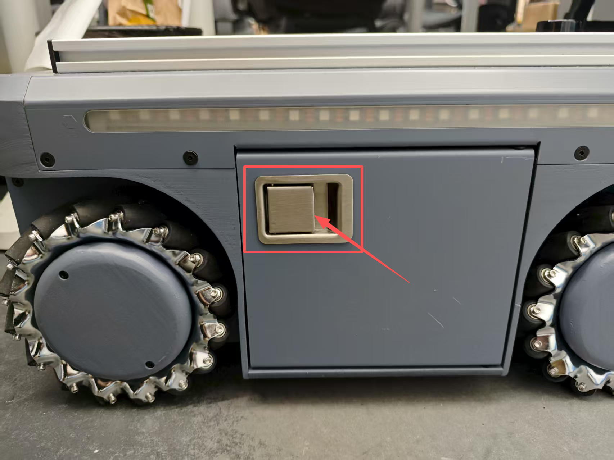
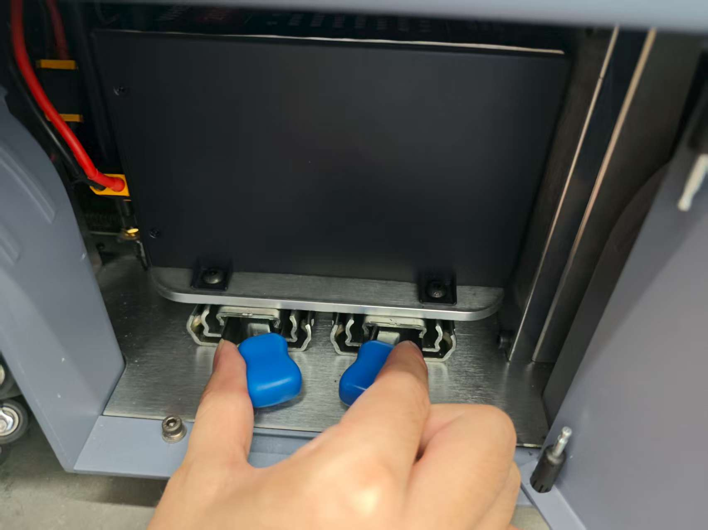
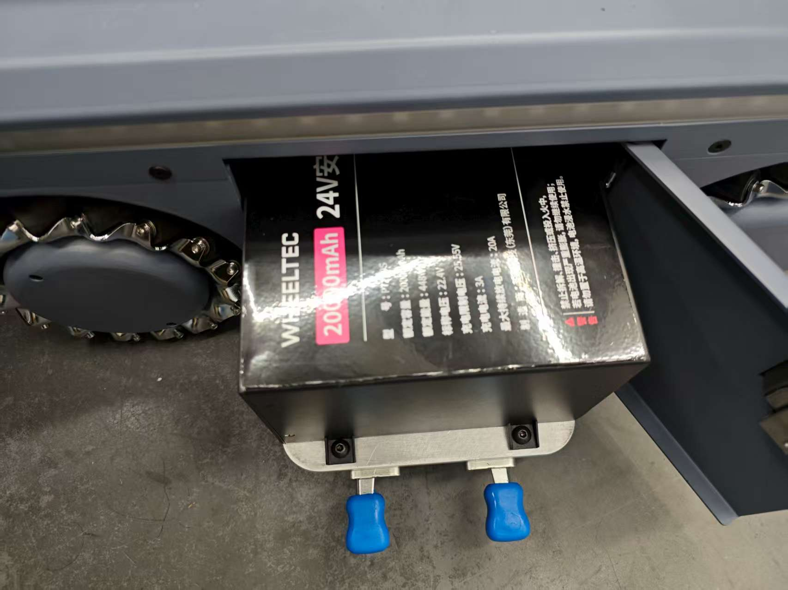
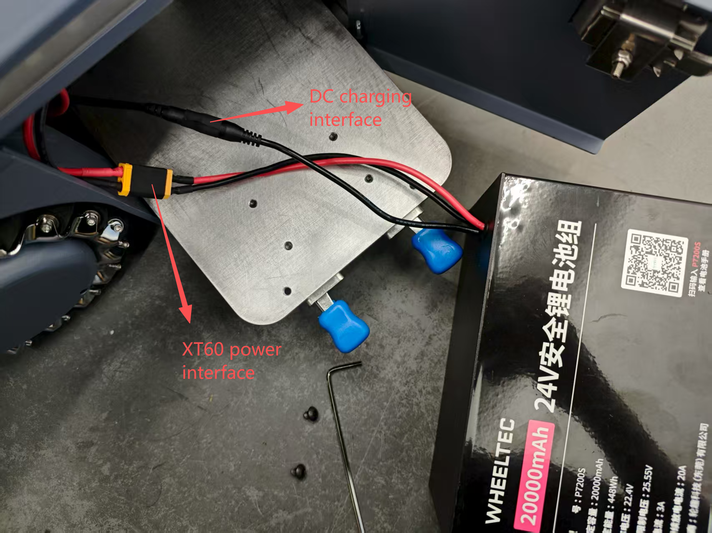
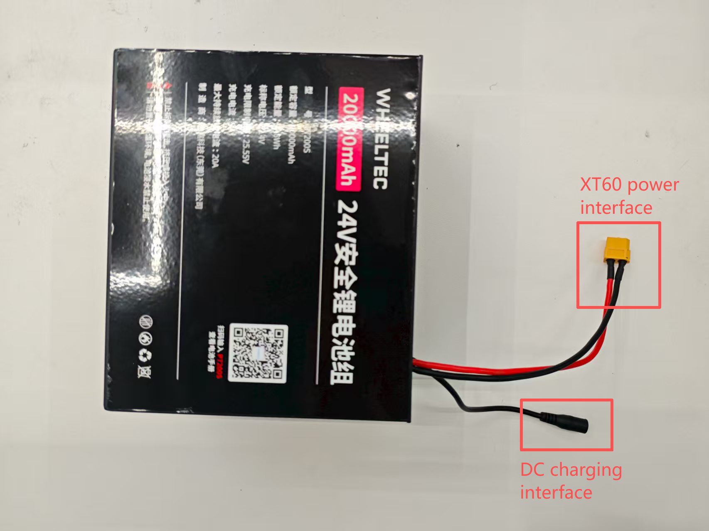
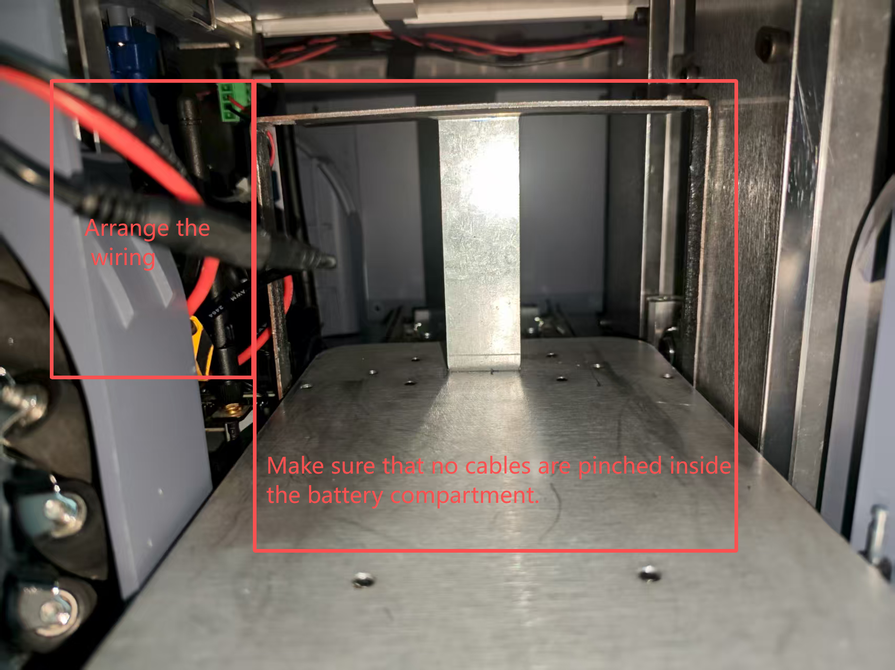
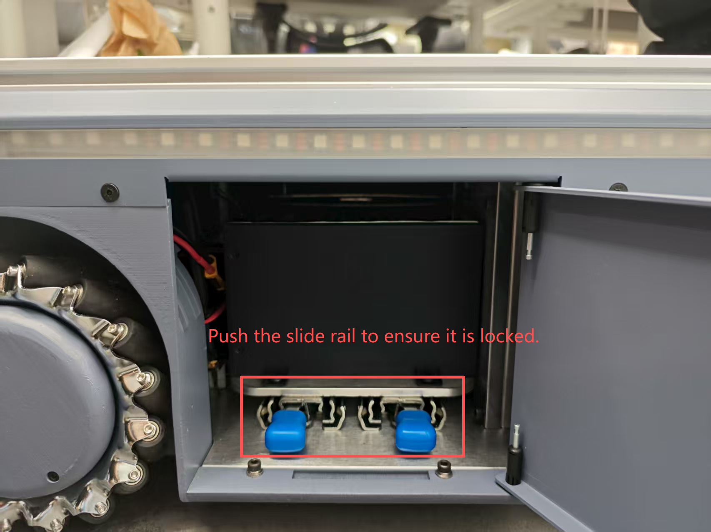

## 3.3 Charging Instructions

### myAGV Light Status and Power Indication Instructions
AGV body LED indicator directly reflects the current remaining power through color and flashing state. Users need to take corresponding actions in time according to the light status:
- **Red light flashing**: remaining power **≤10%**, need to charge immediately (low power warning);
- **Yellow light flashing**: remaining power **>10%** and **≤20%**, it is recommended to charge as soon as possible (low power);
- **Green light always on**: remaining power **>20%**, sufficient power, can operate normally.

### myAGV Charging Recommendations
> When the AGV displays **yellow light flashing**, it is recommended to complete charging within 30 minutes to avoid deep discharge; if it displays **red light flashing**, it is necessary to stop the task and charge immediately. Long-term low power operation may shorten the battery life.

### Charging Adapter Specifications and Usage
- **Interface Type**: DC4017 circular interface (diameter 4.0mm, length 17mm, center positive).
- **Compatibility**: The original standard adapter must be used. Other models or non-certified adapters are prohibited (may cause overvoltage/undervoltage to damage the battery).
- **Connection method**: Align the adapter plug with the AGV charging interface and insert it vertically. The other end of the adapter is connected to a 220V AC power socket (make sure the socket is well grounded).
- **Start charging**: Make sure the AGV is turned off or in standby mode. After connecting the adapter, the AGV charging indicator lights up red and charging begins.
- **Interrupt charging**: After charging is completed, disconnect the adapter from the power socket first, then unplug the AGV end plug. It is prohibited to unplug the plug directly during charging (it may cause arc damage to the interface).
- **Environmental requirements**: The charging environment temperature must be between **0℃~40℃**, avoid high temperature, humidity or poor ventilation environment, and it is prohibited to charge near flammable materials or in a confined space.

### Charging completion and maintenance
- **Charging time**: **6-7 hours to fully charge**. When fully charged, the power adapter indicator light will be solid green.
- **Full determination**: After the green light is always on, it is recommended to continue charging **10-15 minutes** to balance the battery power (the lithium battery protection mechanism may terminate charging early).
- **Long-term storage and charging recommendations**: If the device needs to be parked for more than 7 days, the battery power must be kept in the **50%-70%** range, and a full charge and discharge cycle must be completed every month.
- **Battery maintenance**: Avoid complete discharge (power ≤ 5%), otherwise it may shorten the battery life; regularly check the battery health status (such as internal resistance, capacity attenuation) through the management software.

---
> Tips:
> - The charging adapter is a consumable part. If the plug is loose, overheated, or the light is abnormal, it must be stopped and replaced immediately;
> - Personnel must be on duty during the charging process (especially after the first use or replacement of the adapter). If any abnormalities such as odor or smoke are found, the power must be turned off immediately and contact after-sales.

### Remove and replace the battery from the battery compartment

1.Unlock the side panel lock

2.Pull the battery compartment out from the slide rail

3.Use the Allen wrench to loosen the screws

4.myAGV Pro leads to two wires, namely the XT60 power supply interface and the DC charging interface.

5.Remove and replace the new battery, and also connect it to the XT60 power supply interface and DC charging interface.

6.Arrange the two wires and place them in the space on the left, making sure there is space in the middle so that the battery can be placed in the battery compartment.

7.Tighten the screws using an Allen wrench.

8.Push the battery compartment from the slide rails.

9.Close the side panel lock.

----
[← Previous Page](README.md#chapter-summary) | [Next Page →](3.4-FAQs.md)