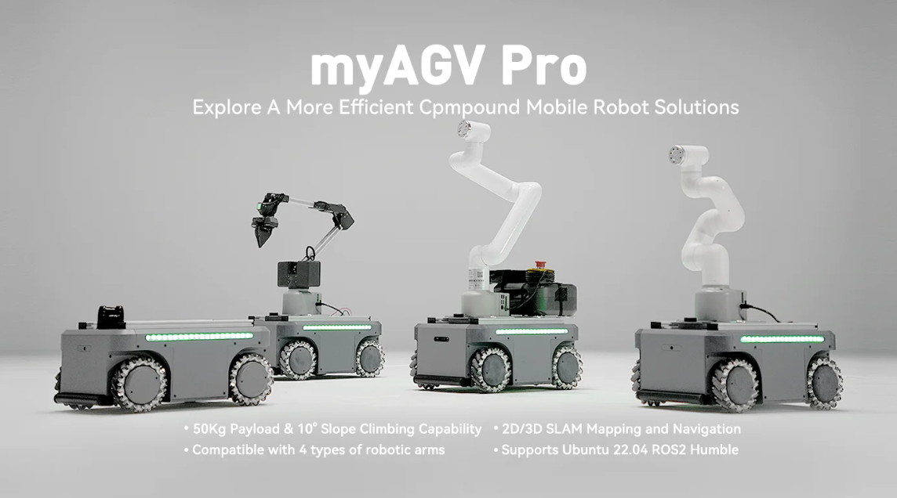

# First installation and use

 

- **Thank you for choosing our product**
  
Before we begin, we would like to sincerely thank you for choosing our product. We are committed to providing you with an excellent user experience.

- **First time use and problem handling**
  
This chapter will introduce in detail the initial use of the product after receiving it, and provide relevant information for solving problems to ensure that you have no worries during use.

## Product unboxing video guide

<video id="my-video" class="video-js" controls preload="auto" width="100%"
poster="" data-setup='{"aspectRatio":"16:9"}'>
  <source src="https://download.elephantrobotics.com/video/myAGV%20Pro/myAGV%20Pro%20Vision-Navigation%20Version%20Unboxing.mp4"></video>

---

- **Jump to each section**
  - [4.1 Basic Edition](4.1-BasicEdition.md)
  - [4.2 Navigation Visual Edition](4.2-NavigationVisualEdition.md)

----
[← Previous Chapter](../3-UserNotes/README.md) | [Next Chapter →](../5-BasicApplication/README.md)
