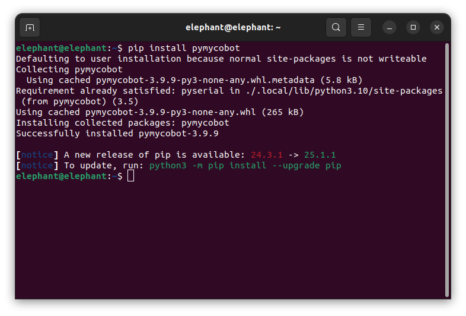

# Environment Building

pymycobot is a Python package used for serial communication with myCobot. It supports Python2, Python3.5 and later versions.

Before using pymycobot, make sure to build a Python environment. Follow the steps below to install Python.

## 1 Download and Installation of Python

At present, Python has two versions: `2.x` and `3.x`. These two versions are incompatible with each other. This section takes the version `3.x` as an example due to its increasing popularity.

### 1.1 Installing Python

Jetson Nano comes with Ubuntu 22.04.5 LTS and a built-in Python development environment, so there's no need to build and manage.

## 2 Preparations

Enter the following command in the terminal: 

```shell
pip install pymycobot --upgrade
```



## 3 Simple Demo

### 3.1 Create a 'example.py' file
Use vim to create 'example.py' files in the myAGV Pro system
```shell
vim example.py
```
### 3.2 Enter the following code
```python
#!/usr/bin/env python
# -*- coding: UTF-8 -*-

from pymycobot import MyAGVPro
import time

agv_pro = MyAGVPro('/dev/ttyACM0', debug=True)

# Move forward at a speed of 0.5ms
agv_pro.move_forward(0.5)

# Wait 2s
time.sleep(2)

# Stop moving
agv_pro.stop()

# Pan to the right at a speed of 0.5ms
agv_pro.move_right_lateral(0.5)

# Wait 2s
time.sleep(2)

# Stop moving
agv_pro.stop()

# Rotate to the right at a speed of 0.5ms
agv_pro.turn_right(0.5)

# Wait 2s
time.sleep(1)

# Stop moving
agv_pro.stop()

```

### 3.3 Run the sample file：
```
python example.py
```

By default, this script will control the myAGV Pro to move forward for two seconds, then pan to the right for two seconds, rotate to the right for another 1s, and then stop moving.

---

[← Previous Page](README.md) | [Next Page →](6.1.2-API.md)
