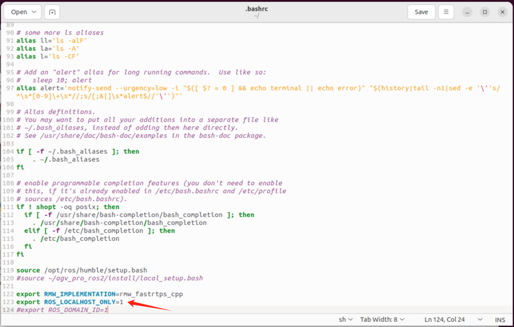

# ROS2 

AGV Pro is developed based on the Jetson Orin Nano Super platform, equipped with the Ubuntu 22.04 LTS operating system, and runs the ROS 2 Humble version.


[ROS 2 Humble](https://docs.ros.org/en/humble/index.html) is the officially recommended stable version for Ubuntu 22.04, with better real-time support, DDS middleware communication, componentized architecture and other advantages.


Humble Hawksbill is the eighth official release of ROS 2, released in May 2022, and will receive long-term support (LTS) until May 2027. Humble supports the following key features for mobile robot development:

- **Nav2 framework**: used for path planning, positioning (AMCL, SLAM), control and other modules
- **Sensor integration**: supports efficient integration of LiDAR, IMU, GPS, and Camera
- **rclcpp/rclpy**: supports both C++ and Python development
- **ros2 launch**: supports parameterized launch based on YAML/param files
- **ros2 bag**: supports recording and replaying sensor data
- **Real-time support**: combined with PREEMPT-RT, a certain degree of control real-time can be achieved

The integration of ROS 2 and Jetson hardware can also be combined with acceleration packages provided by NVIDIA such as [Isaac ROS](https://github.com/NVIDIA-ISAAC-ROS/isaac_ros_visual_slam) or [ros_deep_learning](https://github.com/dusty-nv/ros_deep_learning) to achieve efficient perception tasks.

The AGV Pro ROS2 source code function package is stored in the [github-humble](https://github.com/elephantrobotics/agv_pro_ros2) branch and managed using git.

## AGV Pro ROS2 Code

AGV Pro will compile the ROS2 source code before delivery. To update the code through git, you need to execute the following instructions.

```
cd ~/myagv_ros2/src

git pull

cd ..

colcon build
```

If you are compiling and installing the AGV Pro ROS2 workspace source code for the first time, you need to execute the following instructions:

Create a workspace and clone the AGV Pro ROS2 source code.

```
git clone https://github.com/elephantrobotics/agv_pro_ros2.git agv_pro_ros2/src
```

Install dependencies

```
cd ~/agv_pro_ros2

rosdep install --from-paths src --ignore-src -r -y
```

Build the workspace (it takes about 30 minutes to compile the source code for the first time on Jetson Orin Nano Super)

```
cd ~/agv_pro_ros2

colcon build
```

设置工作区

```
source ~/agv_pro_ros2/install/local_setup.bash
```

> Notes-1

When using the terminal to launch the launch file, remember to `source ~/agv_pro_ros2/install/local_setup.bash`

For example: Launch the launch of the AGV Pro LiDAR and underlying communication

```
source ~/agv_pro_ros2/install/local_setup.bash
ros2 launch agv_pro_bringup agv_pro_bringup.launch.py
```

You can also press ctrl+h in the /home directory to display the hidden file .bashrc, and add the following command at the end of the file so that the environment variables of the ros2 workspace will be sourced every time the terminal is opened.


> Note-2

The default middleware used by ROS 2 for communication is [DDS](https://docs.ros.org/en/humble/Concepts/Intermediate/About-Domain-ID.html). In DDS, the main mechanism for sharing a physical network with different logical networks is called the domain ID. ROS 2 nodes on the same domain can freely discover and send messages to each other, while ROS 2 nodes on different domains cannot. All ROS 2 nodes use domain ID 0 by default. To avoid interference between different groups of computers running ROS 2 on the same network, a different domain ID should be set for each group.

For example, if you have two AGV Pros in the same LAN, to avoid data interference between them, a different domain ID should be set for each group.

```
AGV Pro1  export ROS_DOMAIN_ID=1
AGV Pro2  export ROS_DOMAIN_ID=2
```

Or set environment variables to restrict communication to localhost only.

```
AGV Pro1  export ROS_LOCALHOST_ONLY=1
AGV Pro2  export ROS_LOCALHOST_ONLY=1
```



---

[← Previous Chapter](../6.2-ApplicationBaseROS1/6.2.8-Rtabmap.md) | [Next section →](6.2.2-Real-time_Mapping_with_Gmapping.md)
