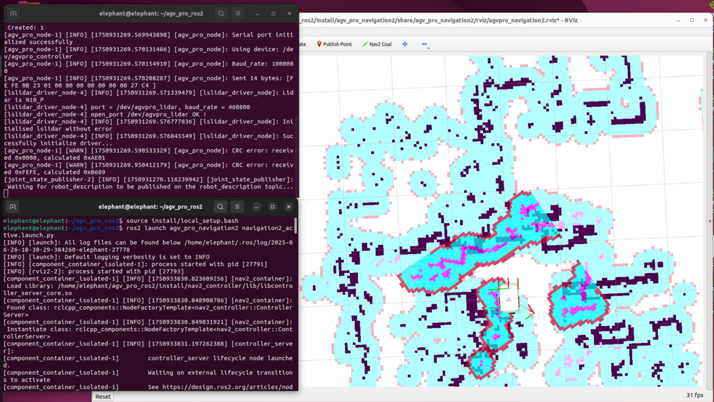
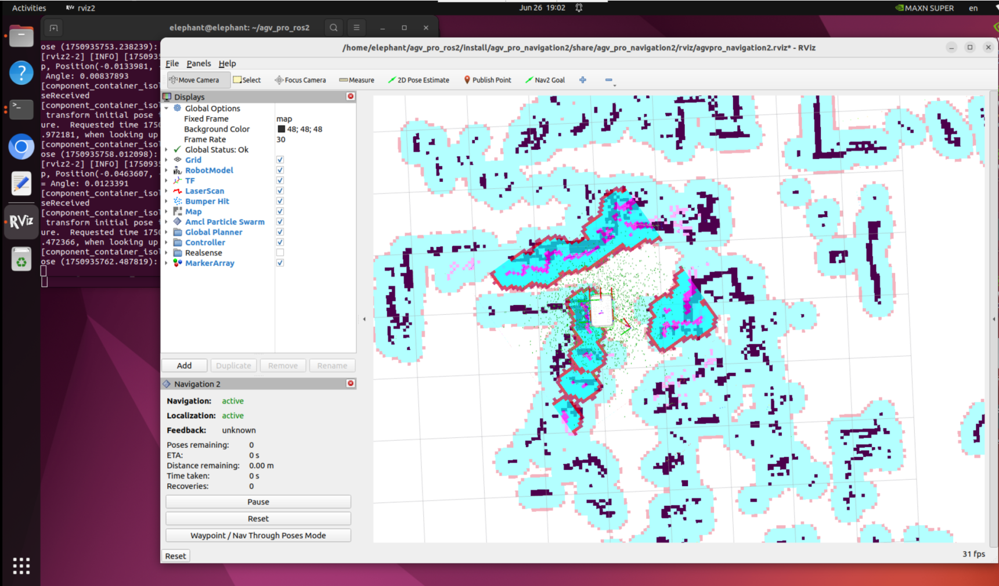
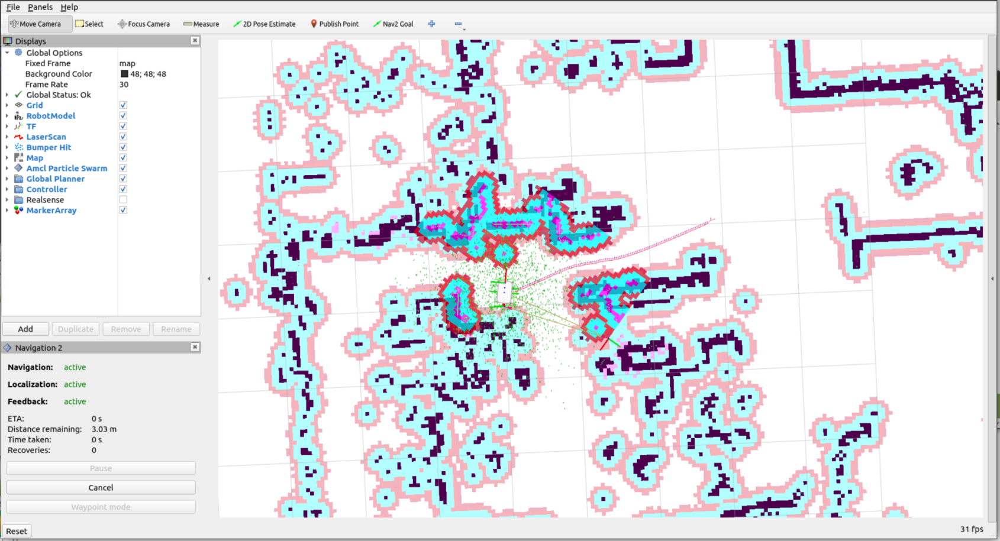
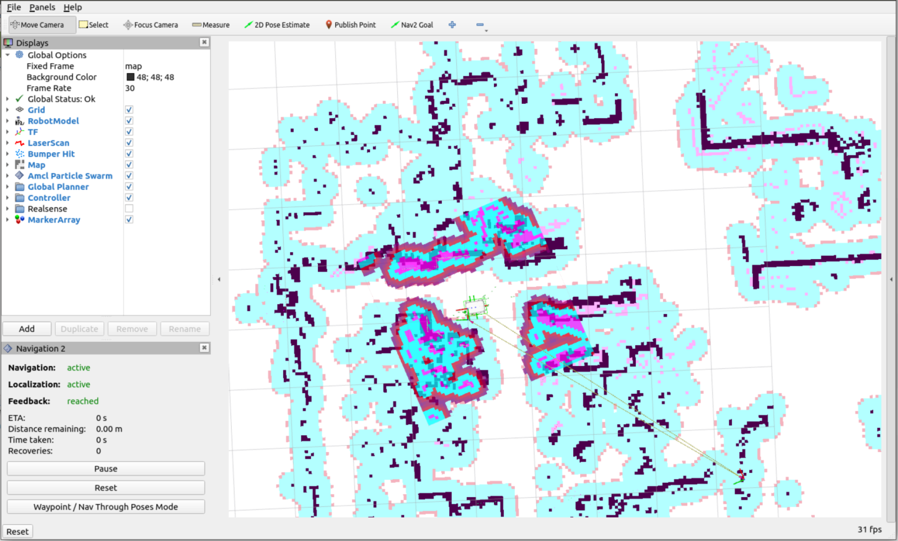
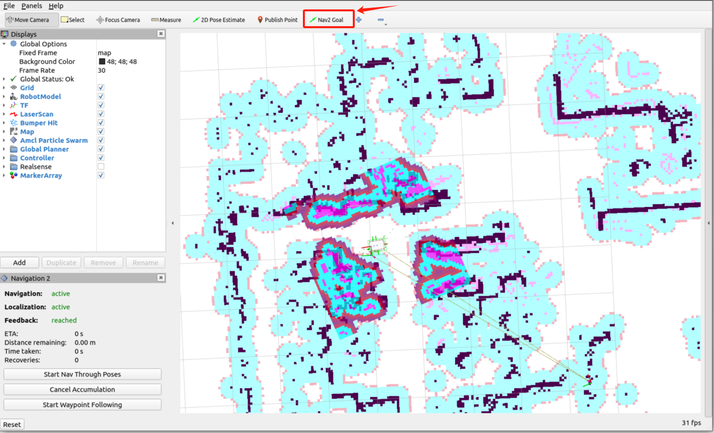
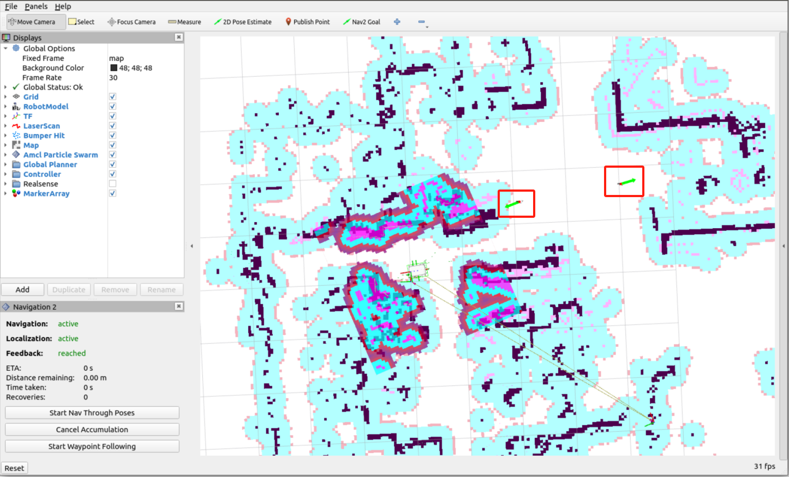
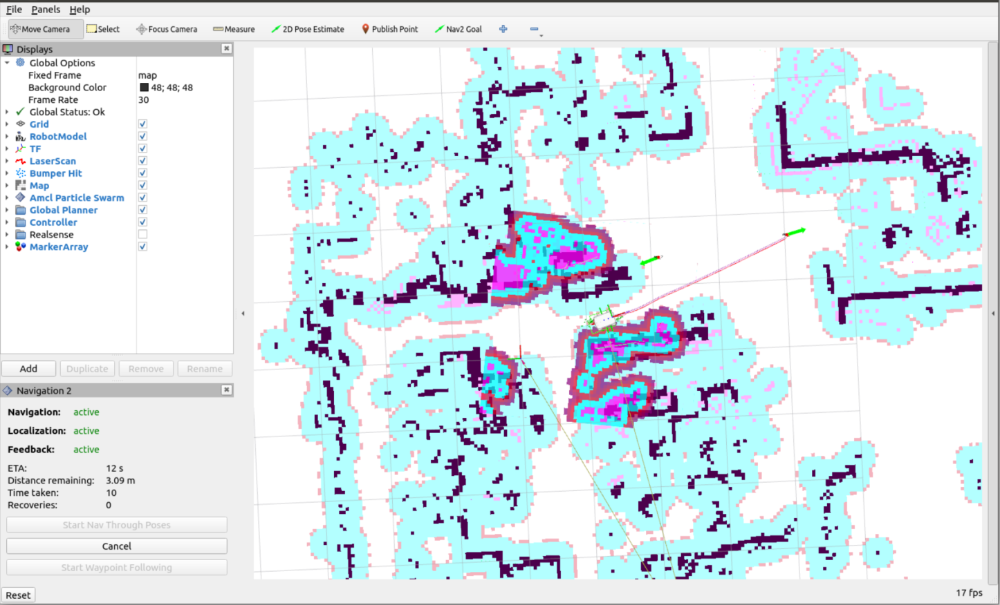
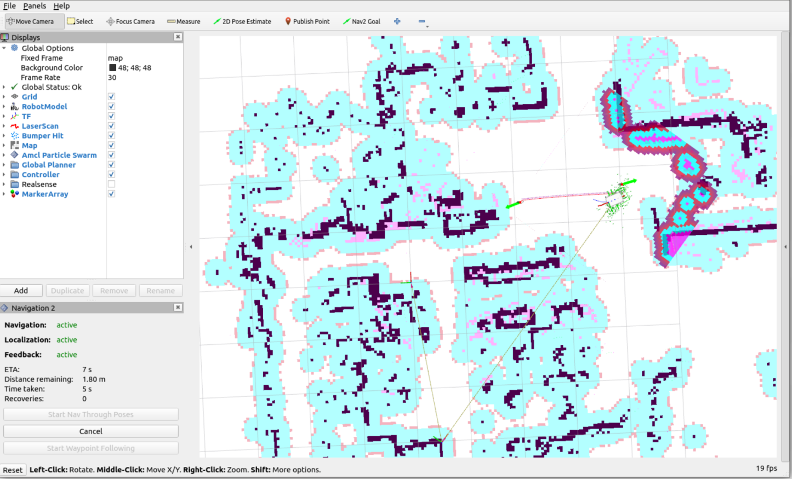
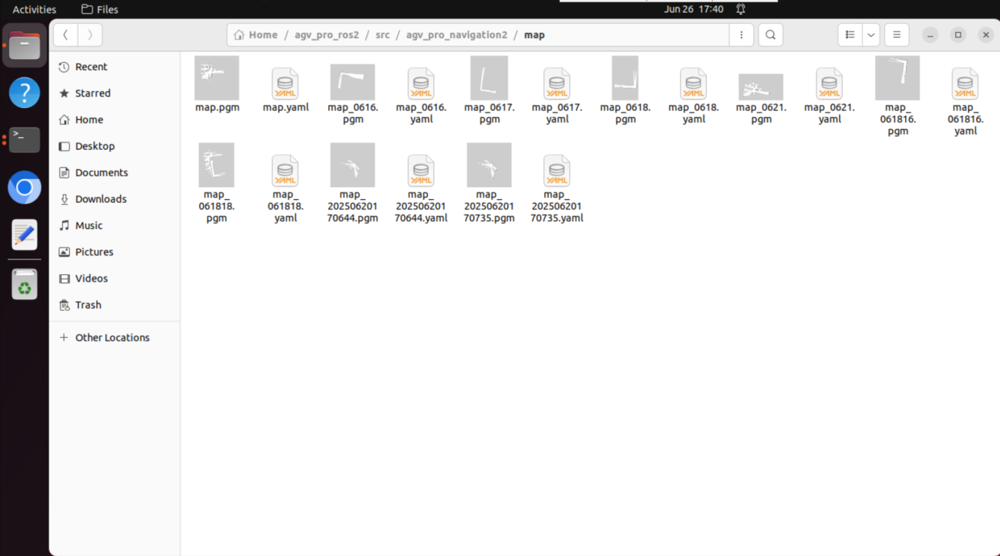

# Nav2

Next, we will introduce and use [Nav2 navigation](https://docs.nav2.org/).


Nav2 is the successor to the ROS Navigation Stack, deploying the same type of technology that powers mobile and surface robotics. This project allows mobile robots to navigate in complex environments to complete user-defined application tasks using nearly any class of robot kinematics. Not only can it move from point A to point B, it can also have intermediate poses and represent other types of tasks such as object tracking, full coverage navigation, and more.

## Start AGVPro underlying communication + laser radar

Press Ctrl+Alt+T on the keyboard, open the first terminal, and enter the command

```
ros2 launch agv_pro_bringup agv_pro_bringup.launch.py
```


## Start Nav2

Press Ctrl+Alt+T on the keyboard to open a second terminal and enter the command:

```
ros2 launch myagv_navigation2 navigation2_active.launch.py
```

This will start an rviz.



First, find the robot's position on the map. Check the position of your robot in the map.

Set the robot's pose in RViz. Click the 2D Pose Estimate button and indicate the robot's position on the map. The direction of the green arrow is the forward direction of the AGVPro.


The 3D model is then moved to that location, and the lidar and map obstacles are observed to see if they match, and that small errors in the estimated position are tolerable.



Select a target location on the map to navigate to. Use the Nav2 Goal button to send the target location and target direction.


Nav2 will plan the path and send motion instructions to complete the navigation.



> Waypoint Following

Click Waypoint/Nav Through Poses Mode in the lower left corner of rviz2 to switch to Waypoint Following Mode



Click Nav2 Goal to publish two navigation points





Click Start Waypoint Following in the lower left corner, and then navigation will proceed in sequence.



After navigating to the first point, continue navigating to the second point



## Change the starting navigation map

In Chapter 6.2.2, we used the slam algorithm to create a spatial map and obtained a set of map files, namely **map.pgm** and map.yaml** in the ~/myagv_ros2/src/myagv_navigation2/map directory. We navigate based on these two map files. The following will introduce how nav2 loads other maps.



Method 1: Modify the launch.py ​​file

Find the file `agv_pro_ros2/agv_pro_navigation2/launch/navigation2_active.launch.py`, change the `'map.yaml'` on line 20 to the map file you need to load, and then compile it through `colcon build`.

```python
import os

from ament_index_python.packages import get_package_share_directory

from launch import LaunchDescription
from launch.substitutions import LaunchConfiguration
from launch.actions import DeclareLaunchArgument,IncludeLaunchDescription
from launch.conditions import IfCondition
from launch.launch_description_sources import PythonLaunchDescriptionSource
from launch_ros.actions import Node

def generate_launch_description():
    use_sim_time = LaunchConfiguration('use_sim_time', default='false')
    use_rviz = LaunchConfiguration('use_rviz', default='true')
    map_dir = LaunchConfiguration(
        'map',
        default=os.path.join(
            get_package_share_directory('agv_pro_navigation2'),
            'map',
            'map.yaml'))

    param_file_name = 'agvpro.yaml'
    param_dir = LaunchConfiguration(
        'params_file',
        default=os.path.join(
            get_package_share_directory('agv_pro_navigation2'),
            'param',
            param_file_name))

    nav2_launch_file_dir = os.path.join(get_package_share_directory('nav2_bringup'), 'launch')

    rviz_config_dir = os.path.join(
        get_package_share_directory('agv_pro_navigation2'),
        'rviz',
        'agvpro_navigation2.rviz')

    return LaunchDescription([
        DeclareLaunchArgument(
            'map',
            default_value=map_dir,
            description='Full path to map file to load'),
    
        DeclareLaunchArgument(
            'params_file',
            default_value=param_dir,
            description='Full path to param file to load'),

        IncludeLaunchDescription(
            PythonLaunchDescriptionSource([nav2_launch_file_dir, '/bringup_launch.py']),
            launch_arguments={
                'map': map_dir,
                'params_file': param_dir}.items(),
        ),

        Node(
            package='rviz2',
            executable='rviz2',
            name='rviz2',
            arguments=['-d', rviz_config_dir],
            parameters=[{'use_sim_time': use_sim_time}],
            condition=IfCondition(use_rviz),
            output='screen'),
    ])
```

Method 2: Add the map parameter when launching launch

When launching `ros2 launch agv_pro_navigation2 navigation2_active.launch.py`, add the `map:=` parameter. For the writing of launch, you can [refer to this link](https://docs.ros.org/en/galactic/Tutorials/Intermediate/Launch/Using-Substitutions.html).
```
ros2 launch agv_pro_navigation2 navigation2_active.launch.py map:=~/agv_pro_ros2/src/agv_pro_navigation2/map/map_demo.yaml
```

## nav2 performance tuning guide

The nav2 navigation framework provides a large number of adjustable parameters. The optimization focus of navigation parameters in different scenarios is different. Users can adjust the parameters according to the [guide provided by nav2](https://docs.nav2.org/tuning/index.html) to obtain the best navigation performance.

The following are the default nav2 parameters of AGV Pro

```yaml
amcl:
  ros__parameters:
    use_sim_time: False
    alpha1: 0.4
    alpha2: 0.3
    alpha3: 0.1
    alpha4: 0.1
    alpha5: 0.1
    base_frame_id: "base_footprint"
    beam_skip_distance: 0.5
    beam_skip_error_threshold: 0.9
    beam_skip_threshold: 0.3
    do_beamskip: false
    global_frame_id: "map"
    lambda_short: 0.1
    laser_likelihood_max_dist: 2.0
    laser_max_range: 100.0
    laser_min_range: -1.0
    laser_model_type: "likelihood_field"
    max_beams: 60
    max_particles: 2000
    min_particles: 500
    odom_frame_id: "odom"
    pf_err: 0.05
    pf_z: 0.99
    recovery_alpha_fast: 0.0
    recovery_alpha_slow: 0.0
    resample_interval: 2
    robot_model_type: "nav2_amcl::OmniMotionModel"
    save_pose_rate: 0.5
    sigma_hit: 0.02
    tf_broadcast: true
    transform_tolerance: 0.3
    update_min_a: 0.06
    update_min_d: 0.025
    z_hit: 0.7
    z_max: 0.001
    z_rand: 0.059
    z_short: 0.24

    # Initial Pose
    set_initial_pose: True
    initial_pose.x: 0.0
    initial_pose.y: 0.0
    initial_pose.z: 0.0
    initial_pose.yaw: 0.0

amcl_map_client:
  ros__parameters:
    use_sim_time: False

amcl_rclcpp_node:
  ros__parameters:
    use_sim_time: False

bt_navigator:
  ros__parameters:
    use_sim_time: False
    global_frame: map
    robot_base_frame: base_footprint
    odom_topic: /odom
    bt_loop_duration: 10
    default_server_timeout: 20
    enable_groot_monitoring: True
    groot_zmq_publisher_port: 1666
    groot_zmq_server_port: 1667
    # 'default_nav_through_poses_bt_xml' and 'default_nav_to_pose_bt_xml' are use defaults:
    # nav2_bt_navigator/navigate_to_pose_w_replanning_and_recovery.xml
    # nav2_bt_navigator/navigate_through_poses_w_replanning_and_recovery.xml
    # They can be set here or via a RewrittenYaml remap from a parent launch file to Nav2.
    plugin_lib_names:
    - nav2_compute_path_to_pose_action_bt_node
    - nav2_compute_path_through_poses_action_bt_node
    - nav2_follow_path_action_bt_node
    - nav2_back_up_action_bt_node
    - nav2_spin_action_bt_node
    - nav2_wait_action_bt_node
    - nav2_clear_costmap_service_bt_node
    - nav2_is_stuck_condition_bt_node
    - nav2_goal_reached_condition_bt_node
    - nav2_goal_updated_condition_bt_node
    - nav2_initial_pose_received_condition_bt_node
    - nav2_reinitialize_global_localization_service_bt_node
    - nav2_rate_controller_bt_node
    - nav2_distance_controller_bt_node
    - nav2_speed_controller_bt_node
    - nav2_truncate_path_action_bt_node
    - nav2_goal_updater_node_bt_node
    - nav2_recovery_node_bt_node
    - nav2_pipeline_sequence_bt_node
    - nav2_round_robin_node_bt_node
    - nav2_transform_available_condition_bt_node
    - nav2_time_expired_condition_bt_node
    - nav2_distance_traveled_condition_bt_node
    - nav2_single_trigger_bt_node
    - nav2_goal_updated_controller_bt_node
    - nav2_is_battery_low_condition_bt_node
    - nav2_navigate_through_poses_action_bt_node
    - nav2_navigate_to_pose_action_bt_node
    - nav2_remove_passed_goals_action_bt_node
    - nav2_planner_selector_bt_node
    - nav2_controller_selector_bt_node
    - nav2_goal_checker_selector_bt_node

bt_navigator_rclcpp_node:
  ros__parameters:
    use_sim_time: False

controller_server:
  ros__parameters:
    use_sim_time: False
    controller_frequency: 5.0
    min_x_velocity_threshold: 0.001
    min_y_velocity_threshold: 0.5
    min_theta_velocity_threshold: 0.001
    failure_tolerance: 3.0
    progress_checker_plugin: "progress_checker"
    goal_checker_plugins: ["general_goal_checker"] # "precise_goal_checker"
    controller_plugins: ["FollowPath"]

    # Progress checker parameters
    progress_checker:
      plugin: "nav2_controller::SimpleProgressChecker"
      required_movement_radius: 0.5
      movement_time_allowance: 10.0
    # Goal checker parameters
    #precise_goal_checker:
    #  plugin: "nav2_controller::SimpleGoalChecker"
    #  xy_goal_tolerance: 0.25
    #  yaw_goal_tolerance: 0.25
    #  stateful: True
    general_goal_checker:
      stateful: True
      plugin: "nav2_controller::SimpleGoalChecker"
      xy_goal_tolerance: 0.25
      yaw_goal_tolerance: 0.25
    # DWB parameters
    FollowPath:
      plugin: "dwb_core::DWBLocalPlanner"
      debug_trajectory_details: True
      min_vel_x: 0.0
      min_vel_y: 0.0
      max_vel_x: 0.26
      max_vel_y: 0.0
      max_vel_theta: 0.5
      min_speed_xy: 0.0
      max_speed_xy: 0.26
      min_speed_theta: 0.0
      # Add high threshold velocity for turtlebot 3 issue.
      # https://github.com/ROBOTIS-GIT/turtlebot3_simulations/issues/75
      acc_lim_x: 2.5
      acc_lim_y: 0.0
      acc_lim_theta: 0.25
      decel_lim_x: -2.5
      decel_lim_y: 0.0
      decel_lim_theta: -0.25
      vx_samples: 20
      vy_samples: 5
      vtheta_samples: 20
      sim_time: 1.7
      linear_granularity: 0.05
      angular_granularity: 0.025
      transform_tolerance: 0.1
      xy_goal_tolerance: 0.25
      trans_stopped_velocity: 0.1
      short_circuit_trajectory_evaluation: True
      stateful: True
      critics: ["RotateToGoal", "Oscillation", "BaseObstacle", "GoalAlign", "PathAlign", "PathDist", "GoalDist"]
      BaseObstacle.scale: 0.02
      PathAlign.scale: 32.0
      PathAlign.forward_point_distance: 0.1
      GoalAlign.scale: 24.0
      GoalAlign.forward_point_distance: 0.1
      PathDist.scale: 32.0
      GoalDist.scale: 24.0
      RotateToGoal.scale: 32.0
      RotateToGoal.slowing_factor: 5.0
      RotateToGoal.lookahead_time: -1.0
      
controller_server_rclcpp_node:
  ros__parameters:
    use_sim_time: False

local_costmap:
  local_costmap:
    ros__parameters:
      update_frequency: 5.0
      publish_frequency: 2.0
      global_frame: odom
      robot_base_frame: base_footprint
      use_sim_time: False
      rolling_window: true
      width: 3
      height: 3
      resolution: 0.05
      footprint: "[[0.26, 0.18], [0.26, -0.18], [-0.26, -0.18], [-0.26, 0.18]]"
      plugins: ["voxel_layer", "inflation_layer"]
      inflation_layer:
        plugin: "nav2_costmap_2d::InflationLayer"
        cost_scaling_factor: 5.0
        inflation_radius: 0.25
      voxel_layer:
        plugin: "nav2_costmap_2d::VoxelLayer"
        enabled: True
        publish_voxel_map: True
        origin_z: 0.0
        z_resolution: 0.05
        z_voxels: 16
        max_obstacle_height: 2.0
        mark_threshold: 0
        observation_sources: scan
        scan:
          topic: /scan
          max_obstacle_height: 2.0
          clearing: True
          marking: True
          data_type: "LaserScan"
          raytrace_max_range: 3.0
          raytrace_min_range: 0.0
          obstacle_max_range: 2.5
          obstacle_min_range: 0.0
      static_layer:
        map_subscribe_transient_local: True
      always_send_full_costmap: True
  local_costmap_client:
    ros__parameters:
      use_sim_time: False
  local_costmap_rclcpp_node:
    ros__parameters:
      use_sim_time: False

global_costmap:
  global_costmap:
    ros__parameters:
      update_frequency: 0.3
      publish_frequency: 0.3
      global_frame: map
      robot_base_frame: base_footprint
      use_sim_time: False
      robot_radius: 0.22
      resolution: 0.05
      track_unknown_space: true
      plugins: ["static_layer", "obstacle_layer", "inflation_layer"]
      obstacle_layer:
        plugin: "nav2_costmap_2d::ObstacleLayer"
        enabled: True
        observation_sources: scan
        scan:
          topic: /scan
          max_obstacle_height: 2.0
          clearing: True
          marking: True
          data_type: "LaserScan"
          raytrace_max_range: 3.0
          raytrace_min_range: 0.0
          obstacle_max_range: 2.5
          obstacle_min_range: 0.0
      static_layer:
        plugin: "nav2_costmap_2d::StaticLayer"
        map_subscribe_transient_local: True
      inflation_layer:
        plugin: "nav2_costmap_2d::InflationLayer"
        cost_scaling_factor: 5.0
        inflation_radius: 0.25
      always_send_full_costmap: True
  global_costmap_client:
    ros__parameters:
      use_sim_time: False
  global_costmap_rclcpp_node:
    ros__parameters:
      use_sim_time: False

map_server:
  ros__parameters:
    use_sim_time: False
    yaml_filename: "turtlebot3_world.yaml"

map_saver:
  ros__parameters:
    use_sim_time: False
    save_map_timeout: 5.0
    free_thresh_default: 0.25
    occupied_thresh_default: 0.65
    map_subscribe_transient_local: True

planner_server:
  ros__parameters:
    expected_planner_frequency: 1.0
    use_sim_time: False
    planner_plugins: ["GridBased"]
    GridBased:
      plugin: "nav2_navfn_planner/NavfnPlanner"
      tolerance: 2.0
      use_astar: false
      allow_unknown: true

planner_server_rclcpp_node:
  ros__parameters:
    use_sim_time: False

recoveries_server:
  ros__parameters:
    costmap_topic: local_costmap/costmap_raw
    footprint_topic: local_costmap/published_footprint
    cycle_frequency: 10.0
    recovery_plugins: ["spin", "backup", "wait"]
    spin:
      plugin: "nav2_recoveries/Spin"
    backup:
      plugin: "nav2_recoveries/BackUp"
    wait:
      plugin: "nav2_recoveries/Wait"
    global_frame: odom
    robot_base_frame: base_footprint
    transform_timeout: 0.1
    use_sim_time: False
    simulate_ahead_time: 2.0
    max_rotational_vel: 1.0
    min_rotational_vel: 0.4
    rotational_acc_lim: 3.2

robot_state_publisher:
  ros__parameters:
    use_sim_time: False

waypoint_follower:
  ros__parameters:
    loop_rate: 20
    stop_on_failure: false
    waypoint_task_executor_plugin: "wait_at_waypoint"   
    wait_at_waypoint:
      plugin: "nav2_waypoint_follower::WaitAtWaypoint"
      enabled: True
      waypoint_pause_duration: 200
```

---

[← Previous Chapter](6.2.2-Real-time_Mapping_with_Gmapping.md) | [Next section →](6.2.4-multi_control.md)
