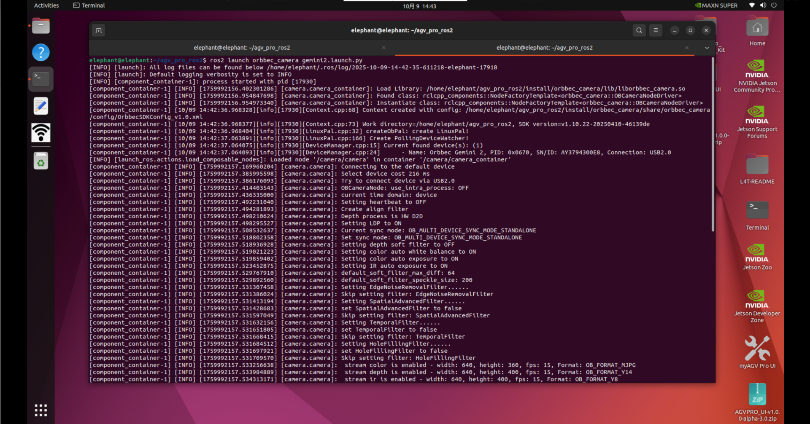
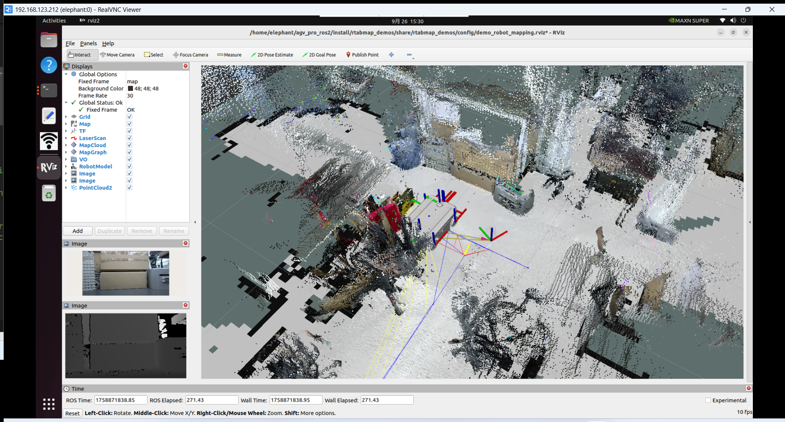
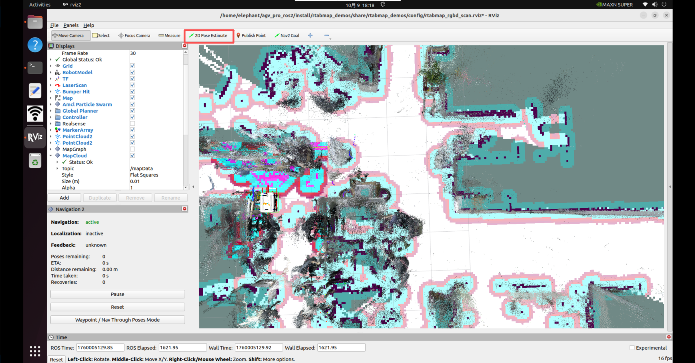

# Rtabmap Overview

[RTAB-Map](https://introlab.github.io/rtabmap/) (Real-Time Appearance-Based Mapping) is a RGB-D, Stereo and Lidar Graph-Based SLAM approach based on an incremental appearance-based loop closure detector. The loop closure detector uses a bag-of-words approach to determinate how likely a new image comes from a previous location or a new location. When a loop closure hypothesis is accepted, a new constraint is added to the map’s graph, then a graph optimizer minimizes the errors in the map. A memory management approach is used to limit the number of locations used for loop closure detection and graph optimization, so that real-time constraints on large-scale environnements are always respected. RTAB-Map can be used alone with a handheld Kinect, a stereo camera or a 3D lidar for 6DoF mapping, or on a robot equipped with a laser rangefinder for 3DoF mapping.


## Mapping

1.Press Ctrl+Alt+T on the keyboard to open the first terminal and run the following command to start the odometry and lidar nodes.

```
ros2 launch agv_pro_bringup agv_pro_bringup.launch.py
```


2.Press Ctrl+Alt+T on the keyboard to open a second terminal and run the following command to start the depth camera node.

```
ros2 launch orbbec_camera gemini2.launch.py
```



3.Press ctrl+alt+t on the keyboard to open a third terminal and run the following command to start Rtabmap SLAM mapping.

```
ros2 launch rtabmap_demos robot_mapping_demo.launch.py rviz:=true rtabmap_viz:=false
```

- `rviz`: Launches the rviz2.
- `rtabmap_viz`: Launch RTAB-Map UI (optional).

4.After launching the RViz2 visualization interface,you will see the occupancy grid map generated from the LiDAR and the point cloud mapping produced by the depth camera.

At this point, press Ctrl + Alt + T to open a fourth terminal, and run the keyboard teleoperation node to control the myAGV Pro robot and complete the mapping process of the environment.

```
ros2 run teletop_twist_keyboard teletop_twist_keyboard
```


**Note:**
To ensure high-quality mapping results, when using the keyboard to control the robot during the mapping process, it is recommended to keep the robot moving at a **steady and consistent speed**.Sudden acceleration, sharp turns, or prolonged in-place rotation may lead to reduced mapping accuracy or mapping failure.It is recommended to use the **default control parameters** of the keyboard teleoperation node:`speed = 0.25`, `turn = 0.5`.



After completing the mapping of the desired environment (as shown above), return to the terminal where `robot_mapping_demo.launch.py` is running and press **Ctrl + C** to stop the program. When the program is terminated, the generated map database will be automatically saved at:`~/.ros/rtabmap.db`

Note that `~/.ros` is a **hidden directory**. You can press **Ctrl + H** in your file browser to display hidden folders.

## Rtabmap + Nav2: Simultaneous Localization, Mapping, and Navigation

You can use **RTAB-Map** to perform SLAM (Simultaneous Localization and Mapping) and navigation at the same time. In this setup, **RTAB-Map** replaces the **AMCL** component in **Nav2**, taking over the robot’s localization and mapping tasks within the navigation framework.


**RTAB-Map** supports mapping with various types of sensor data.


The **myAGV Pro Navigation Edition** is equipped with both an [RGB-D camera](../../2-ProductFeature/2.2-VisualNavigationEdition.md#3d-depth-camera-gemini-2-technical-specifications-optional) and a [2D LiDAR](../../2-ProductFeature/2.2-VisualNavigationEdition.md#n10-plus-lidar-technical-specifications-optional).

The following section introduces how to integrate **RTAB-Map (RGB-D + Laser Scan + Odometry)** with **Nav2** for mapping and navigation.

1.Press Ctrl+Alt+T on the keyboard to open the first terminal and run the following command to start the odometry and lidar nodes.

```
ros2 launch agv_pro_bringup agv_pro_bringup.launch.py
```


2.Press Ctrl+Alt+T on the keyboard to open a second terminal and run the following command to start the depth camera node.

```
ros2 launch orbbec_camera gemini2.launch.py
```


3.Press **Ctrl + Alt + T** to open a third terminal, and run the following command to launch **RTAB-Map SLAM** together with **Nav2**.

```
ros2 launch rtabmap_demos agvpro_rgbd_scan.launch.py
```

4.After launching the **RViz2** visualization interface, you will see the **occupancy grid map** generated from the LiDAR and the **point cloud mapping** generated from the depth camera.

In addition, the **Nav2 plugins** will already be loaded in the lower-left panel of RViz.You can also visualize the **obstacle layer**, **voxel layer**, and **inflation layer** from Nav2’s costmap in RViz.

The **voxel layer** is maintained using data from RTAB-Map’s `/camera/obstacles` and `/camera/ground` point cloud topics, together with the `/scan` 2D LiDAR data.Compared with navigation using only a 2D LiDAR, this setup enables **more robust and optimized path planning and navigation**.


Click the **“Nav2 Goal”** button in RViz, then drag an arrow on a free area of the occupancy grid to set a navigation goal.

The **myAGV Pro** robot will perform path planning and autonomously navigate to the target while simultaneously localizing and mapping.

For more details on navigation, please refer to the [Section 6.2.3 - Navigation2](6.2.3-Navigation2.md).

After completing the mapping of the desired environment (as shown below), return to the terminal where `agvpro_rgbd_scan.launch.py` is running and press **Ctrl + C** to stop the program.When the program is terminated, the generated map database will be automatically saved at:`~/.ros/rtabmap.db`

Note that `~/.ros` is a **hidden directory**. You can press **Ctrl + H** in your file browser to show hidden folders.


5\.In addition, you can also perform **simultaneous localization, mapping, and navigation** using only the **RGB-D camera**.

```
# Example:
#   Bringup agvpro:
#     $ ros2 launch agv_pro_bringup agv_pro_bringup.launch.py
#
#   Bringup orbbec gemini2 camera:
#     $ ros2 launch orbbec_camera gemini2.launch.py
#
#   SLAM:
#     $ ros2 launch rtabmap_demos agvpro_rgbd.launch.py
```

6.Similarly, you can perform **simultaneous localization, mapping, and navigation** using only the **2D LiDAR**.

```
# Example:
#   Bringup agvpro:
#     $ ros2 launch agv_pro_bringup agv_pro_bringup.launch.py
#
#   SLAM:
#     $ ros2 launch rtabmap_demos agvpro_scan.launch.py
```

## Rtabmap + Nav2 Localization and Navigation

After constructing a map of the environment, you can switch **RTAB-Map** to **localization mode** to prevent the map from expanding further in already mapped areas.

This is equivalent to loading a **pre-built map** (`~/.ros/rtabmap.db`) and performing **relocalization-based navigation**.To enable localization mode, simply add the following parameter when launching your launch file:

```
ros2 launch rtabmap_demos agvpro_rgbd_scan.launch.py localization:=true
```

Move the robot until it successfully **relocalizes** within the previously created map.Once a **loop closure** is detected, the 2D occupancy map will reappear, and you can continue with normal navigation tasks.


> **Note:**
>  When using RTAB-Map for SLAM-based mapping and navigation, **RTAB-Map replaces the AMCL module** in Nav2 for localization.
>  Therefore, the **“2D Pose Estimate”** function in RViz (previously used with AMCL) is **not applicable** in this configuration.



---

[← Previous Page](6.2.8-Autocharge.md)