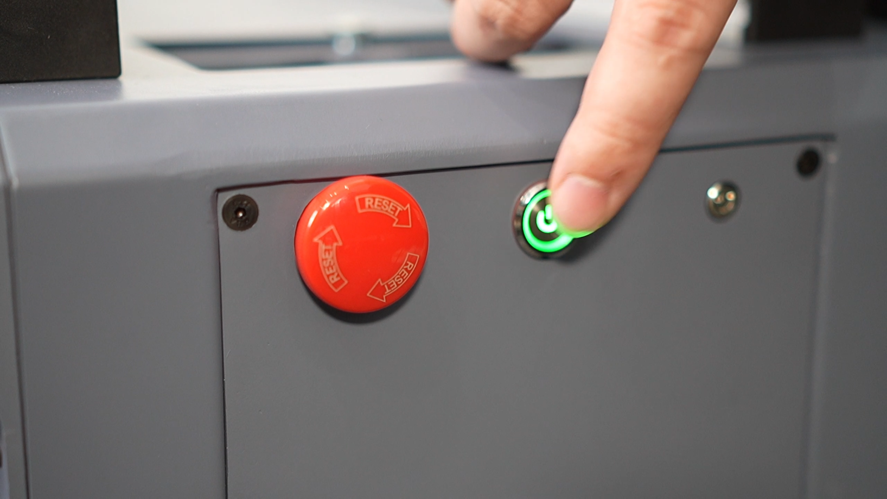

## Home storage training


## 1. Hardware deployment

### 1.1 Hardware inventory

| Name                                | Quantity | Remarks |
|-------------------------------------|----------|---------|
| External fixing plate               | 1        |         |
| M5 slider nut                       | 4        |         |
| M5*10 screw                         | 4        |         |
| MyArm M750                          | 1        |         |
| myAGV Pro Navigation-Visual Edition | 1        |
| Wireless handle                     | 1        |
| USB cable                           | 1        |
| Wrench tool                         | 1        |
| XT60 adapter cable                  | 1        |

### 1.2 Hardware Hookup

1. Use M510 screws to secure the M5 slider nut to the external fixing plate
   
2. Attach the external fixing plate to the 2040 profile on the myAGVPro
   
3. Align the myArm M750 base with the screw holes on the external mounting plate
   
4. Attach the myArm M750 base to the external mounting plate
   
5. Connect to an emergency stop
   
6. Use the XT60 adapter cable to connect to the myArm M750
   
7. Connect the other end with the XT60 power port on the myAGV Pro
   
8. To start myAGV Pro, you need to release the emergency stop first, and then press the power switch
   
9. To start myArmM750, you also need to release the emergency stop first, and then press the power switch to wait for the MyArmM750 to boot up
10. Use a 'Type-C' cable to connect myArm M750 to myAGV Pro
    
    
11. At this point, the hardware connection between MyArm M750 and myAGV Pro is completed, and the finished product is as follows:
    

## 2. Software Deployment

### 2.1 MyArm M750 firmware burning

Flash the firmware by visiting the M750 [Flashing and Updating Firmware](https://docs.elephantrobotics.com/docs/myarm-master_750-en/4-FunctionsAndApplications/5-BasicFunctions/5.2-SoftwareUsageInstructions/5.2.3-flash_firmwares.html)
section

### 2.2 myAGVPro firmware flashing

Burn the firmware by visiting the myAGVPro [How to Burn Firmware](../5-BasicApplication/5.3-FirmwareUse/5.3.2-HowToBurnFirmware.md) section

## 3. Download the source code

Download the MyArmM750 home storage training handle control case source code to your local computer

### 3.1 Download the source code

1. Use the git tool to download the source code to your local computer
   ```shell
   git clone https://github.com/elephantrobotics/pymycobot.git
   ````
2. Use the browser URL to download the source code package
   

- Visit [https://github.com/elephantrobotics/pymycobot.git](https://github.com/elephantrobotics/pymycobot.git)
- Click the `Code` button
- Click the `Download ZIP` button
- After downloading, unzip it to your local computer

### Enter the `myAGVPro_Composite_Kit` directory

Use the `cd` command to enter the `pymycobot/demo/myAGVPro_Composite_Kit` directory

```shell
cd pymycobot/demo/myAGVPro_Composite_Kit
```

### 3.3 Download dependencies

Use the `pip` command to download dependencies

```shell
pip install -r requirements.txt
```

### 3.4 Modify configuration

1. Open the `main.py` file and change the value of `COMPOSITE_KIT_TYPE` to `MyArmM750`
    ```python
    ...
    # ##############################################################################################
    # Composite kit configuration
    # ##############################################################################################
    COMPOSITE_KIT_TYPE = "MyArmM750"  # MyCobotPro630, MyCobot320, MyArmM750, Undefined
    DEBUG = False
    ...
    ```

2. Configure the serial port of `MyArmM750`, and check it through the `ls /dev/tty*` command. Under normal circumstances, the default is `/dev/ttyACM2`

    ```python
    ...
    # ##############################################################################################
    # MyCobot M750 and MyCobot 320 Configuration
    # ##############################################################################################
    COMPOSITE_KIT_COMPORT = "/dev/ttyACM2"
    ...
    ```

### 3.5 Run source code

Use the `python` command to run the source code

```shell
python main.py
```

## 4. Quick experience

MyAGV pro + MyArm M750 handle control function definition is as follows:


> **Note:** Before starting the program, you need to connect the handle's receiver to the myAGV Pro's `USB` port. After the program starts, when the handle's receiver is disconnected, the program will automatically exit

