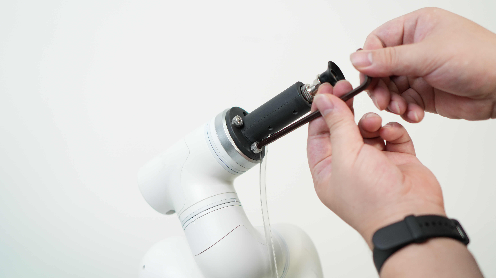
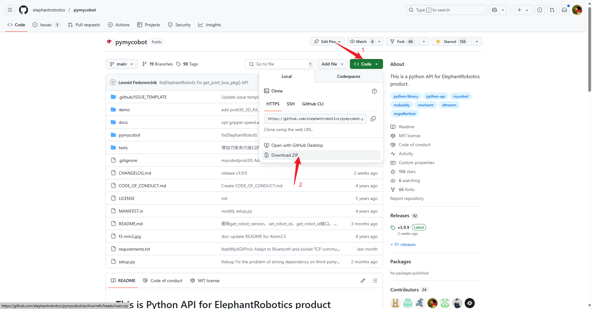

## Warehouse cargo handling


## 1. Hardware deployment

### 1.1 Hardware list

| Name                                | Quantity | Remarks |
|-------------------------------------|----------|---------|
| External fixing plate               | 1        |         |
| M5 slider nut                       | 8        |         |
| M5*10 screw                         | 8        |         |
| MyCobot 320 M5                      | 1        |         |
| myAGV Pro Navigation-Visual Edition | 1        |
| Wireless handle                     | 1        |
| USB cable                           | 1        |
| Wrench tool                         | 1        |
| XT60 adapter cable                  | 1        |
| Vertical suction pump 2.0           | 1        |
| Emergency stop                      | 1        |

### 1.2 Hardware connection

1. Use M5*10 screws to fix the M5 slider nut on the external fixing plate
   
2. Connect the external mounting plate to the 2040 profile on myAGVPro
   
3. Align the myCobot320 M5 base with the screw holes on the external mounting plate
   
4. Fix the myCobot320 M5 base to the external mounting plate
   
5. Connect the emergency stop
   

6. Connecting the vertical suction pump to MyCobot320 M5
    1. Take another external fixing plate and connect it to the 2040 profile on myAGVPro, and fix the screws
       
    2. After fixing, use sticky rice glue to fix the vertical suction pump box on the external fixing plate
    3. Fix the vertical suction pump to the end of MyCobot320 M5
       
    4. Then connect the vertical suction pump line to the Basic IO output interface of myCobot320 M5
       

7. Use the XT60 adapter cable to connect to MyCobot320 M5
   
8. Connect the other end to the XT60 power port on myAGV Pro
   
9. To start myAGV Pro, you need to release the emergency stop first, then press the power switch
   
10. To start MyCobot320 M5, you also need to release the emergency stop first, then press the power switch, and wait for
    MyCobot320 to start up
11. Use the `Type-C` cable to connect MyCobot320 M5 and myAGV Pro
    
    
12. At this point, the hardware connection between MyCobot320 M5 and myAGV Pro is completed, and the finished product is
    as follows:
    

## 2. Software deployment

### 2.1 MyCobot320 firmware burning

Burning firmware by visiting MyCobot320
M5 [Burn and update firmware](https://docs.elephantrobotics.com/docs/mycobot_320_m5_en/5-BasicApplication/5.2-ApplicationUse/mystudio/320m5/3-flash_firmwares.html)

### 2.2 myAGVPro firmware burning

Burning firmware by visiting
myAGVPro [How to burn firmware](../5-BasicApplication/5.3-FirmwareUse/5.3.2-HowToBurnFirmware.md)

## 3. Source code download

Download the MyCobot320 M5 warehouse cargo handling handle control case source code to the local computer

### 3.1 Download source code

1. Use the git tool to download the source code to the local computer

    ```shell
    git clone https://github.com/elephantrobotics/pymycobot.git
    ```

2. Use a browser to visit the URL to download the source code compressed package
   

- Visit [https://github.com/elephantrobotics/pymycobot.git](https://github.com/elephantrobotics/pymycobot.git)
- Click the `Code` button
- Click the `Download ZIP` button
- After downloading, unzip it to any folder

### 3.2 Enter the `myAGVPro_Composite_Kit` directory

Use the `cd` command to enter the `pymycobot/demo/myAGVPro_Composite_Kit` directory

```shell
cd pymycobot/demo/myAGVPro_Composite_Kit
```

### 3.3 Download dependencies

Use the `pip` command to download dependencies

```shell
pip install -r requirements.txt
```

### 3.4 Modify configuration

1. Open the `main.py` file and change the value of `COMPOSITE_KIT_TYPE` to `MyCobot320`

    ```python
    ...
    # ##############################################################################################
    # Composite kit configuration
    # ##############################################################################################
    COMPOSITE_KIT_TYPE = "MyCobot320"  # MyCobotPro630, MyCobot320, MyArmM750, Undefined
    DEBUG = False
    ...
    ```

2. Configure the serial port of `MyCobot320`, and check it through the `ls /dev/tty*` command. Under normal
   circumstances, the default is `/dev/ttyACM2`

    ```python
    ...
    # ##############################################################################################
    # MyCobot M750 and MyCobot 320 Configuration
    # ##############################################################################################
    COMPOSITE_KIT_COMPORT = "/dev/ttyACM2"
    ...
    ```

### 3.5 Run source code

Use the `python` command to run the source code

```shell
python main.py
```

## 4. Quick experience

MyAGVPro+MyCobot320 handle control function definition is as follows:


> **Note:** Before starting the program, you need to connect the handle receiver to the `USB` port of myAGV Pro. After
> the program is started, when the handle receiver is disconnected, the program will automatically exit

